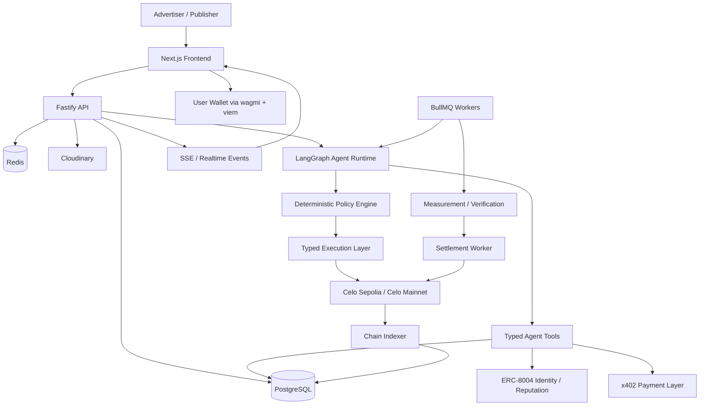
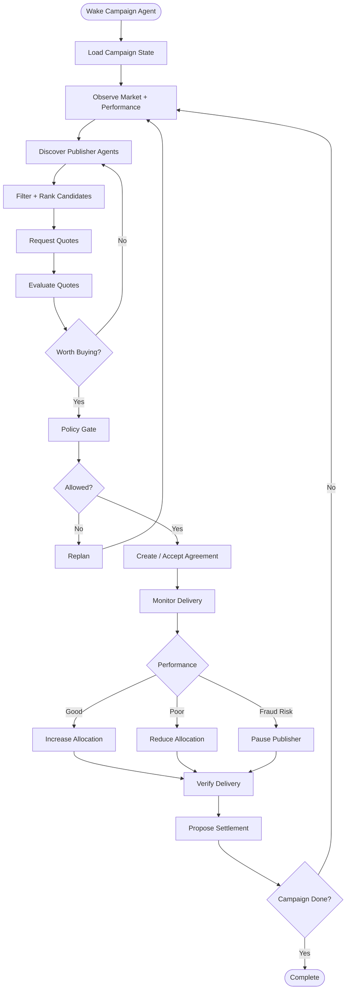
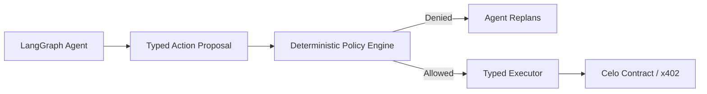
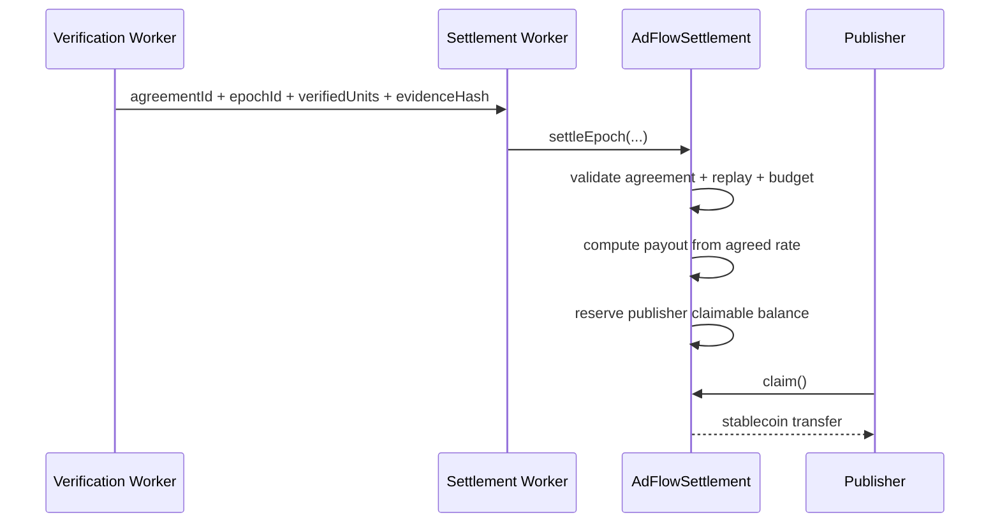
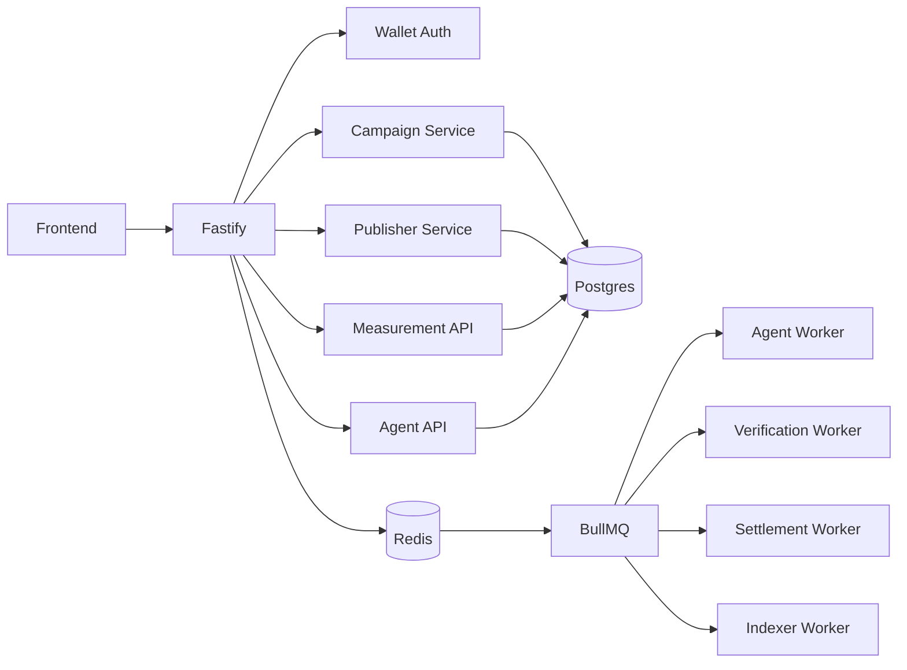
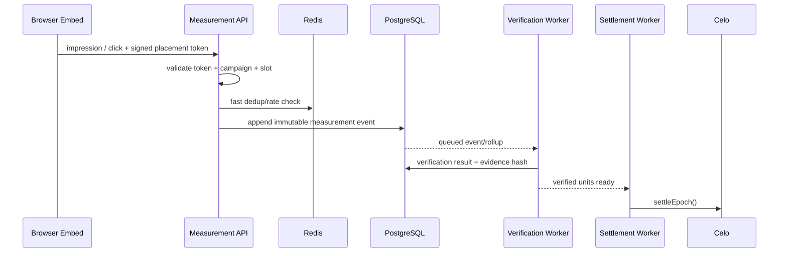
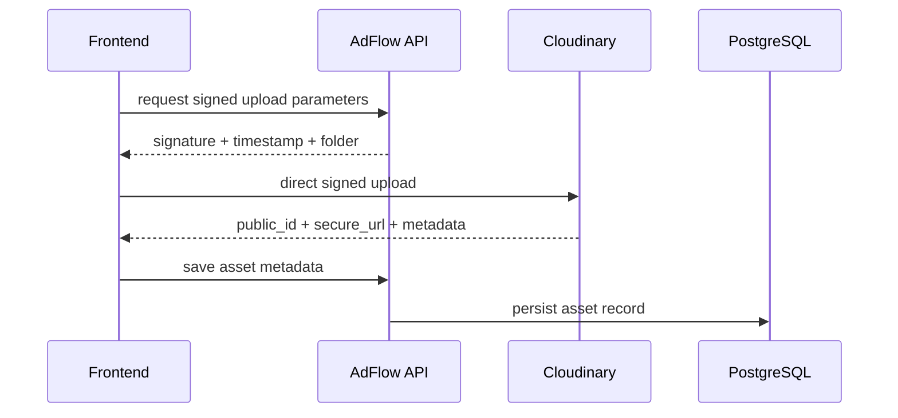
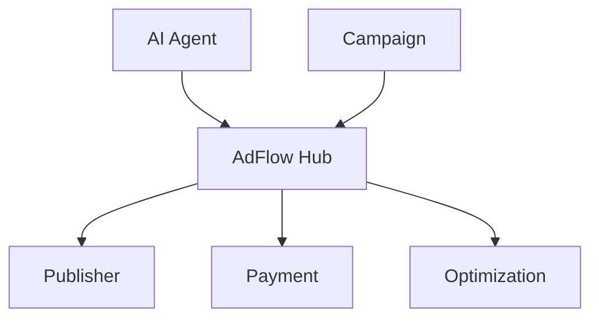
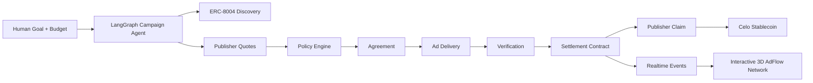

# AdFlow — Master Refresh Specification

> **Single source of truth for the current AdFlow build.**  
> AdFlow is a Celo-native autonomous advertising marketplace where AI agents discover publisher inventory, negotiate bounded campaign terms, optimize allocation, verify delivery, and settle publishers using stablecoins.

---

## 1. Product Thesis

Traditional ad networks are centralized: the platform controls discovery, pricing, measurement, and settlement. AdFlow turns the marketplace into an **agent economy**.

An advertiser gives a Campaign Agent a goal, budget, targeting rules, and hard financial constraints. Publisher Agents expose ad inventory and pricing. The Campaign Agent discovers suitable publishers, evaluates reputation and inventory quality, requests quotes, negotiates or accepts terms, creates agreements, monitors performance, reallocates budget, and proposes settlement based on verified delivery.

The key principle is:

> **Agents choose. Policies constrain. Contracts enforce. Evidence settles.**

The LLM is never the source of financial truth and never receives an unrestricted wallet tool.

---

## 2. High-Level Architecture



AdFlow uses **Celo Sepolia first**. Mainnet stays disabled until the system passes deployment, settlement, reconciliation, and policy safety checks.

---

## 3. Celo Strategy

### Development network

- **Network:** Celo Sepolia
- **Chain ID:** `11142220`
- **Default RPC:** `https://forno.celo-sepolia.celo-testnet.org`
- Public Forno is enough initially; a private RPC can be added later.

### Mainnet

Mainnet is optional and only enabled after explicit configuration:

```env
MAINNET_ENABLED=false
STRICT_POLICY_MODE=true
```

### What Celo is used for

1. Campaign escrow.
2. Stablecoin settlement.
3. Publisher claims.
4. Agent identity and reputation through ERC-8004.
5. Agent-to-agent paid HTTP resources through x402 where appropriate.
6. Transaction attribution for AdFlow-generated activity when hackathon/Celo attribution is available.

---

## 4. Agent Architecture — LangGraph

AdFlow uses **LangGraph JS/TypeScript** as the orchestration runtime because campaigns are long-running state machines, not one-shot chat completions.



### Agents

**Campaign Agent** — primary autonomous actor.

- Understands campaign objective.
- Discovers publishers.
- Reads ERC-8004 reputation.
- Requests/evaluates quotes.
- Chooses allocations.
- Monitors performance.
- Reallocates spend.
- Proposes settlement.

**Publisher Agent** — represents publisher inventory.

- Exposes sites/slots.
- Enforces category restrictions.
- Evaluates advertiser/campaign eligibility.
- Quotes CPC/CPM/reservation terms.
- Accepts, counters, or rejects offers.

**Verification Agent/Service** — primarily deterministic, not LLM-driven.

- Duplicate detection.
- Token validation.
- Click/impression velocity checks.
- Campaign/agreement validity.
- Quotas.
- Suspicious traffic heuristics.
- Evidence generation.

LLM reasoning may assist edge cases, but it never decides arbitrary payouts.

---

## 5. Agent Financial Safety

The LLM produces **action proposals**, not transactions.



Every economic action is checked against rules such as:

- campaign active;
- amount within remaining budget;
- CPC/CPM below campaign maximum;
- allowed stablecoin;
- publisher allowed;
- reputation threshold met;
- daily/transaction allowance not exceeded;
- agreement valid;
- chain is correct;
- campaign has not expired;
- action is idempotent and non-replayed.

For high-value actions, LangGraph can interrupt and wait for human approval.

---

## 6. Smart Contracts

The coding agent is responsible for writing, testing, compiling, deploying, and integrating the contracts. The user does **not** provide pre-existing AdFlow addresses or ABIs.

### `AdFlowCampaignVault.sol`

Responsibilities:

- create campaign;
- deposit/fund campaign;
- top up campaign;
- store budget and financial policy;
- track available, committed, and spent balances;
- pause/resume;
- expire/end campaign;
- withdraw unspent funds;
- enforce ownership.

### `AdFlowSettlement.sol`

Responsibilities:

- publisher agreements;
- CPC/CPM pricing;
- settlement epochs;
- replay protection;
- settlement authorization;
- publisher claimable balances;
- publisher claims.

### Optional `AdFlowAgentRegistryAdapter.sol`

Used only if we need convenient mapping/caching between AdFlow entities and ERC-8004 identities. It must not replace the official ERC-8004 registries.

### Settlement invariant

Workers never send an arbitrary payout amount.

```text
verifiedUnits × agreedRate ÷ unitScale = payout
```

For CPC, `unitScale = 1`.

For CPM, `unitScale = 1000`.



Generated compiler ABIs are the only source of truth. Never hand-maintain production ABIs.

---

## 7. User vs Backend Signing

### Frontend-wallet signed

- create campaign;
- approve stablecoin;
- fund/top up;
- pause/resume;
- accept user-owned agreement actions;
- withdraw unspent funds;
- publisher claims.

### Backend settlement signer

Only a restricted `SETTLEMENT_OPERATOR_PRIVATE_KEY` is allowed to submit verified settlement epochs.

It must **not** be able to:

- withdraw advertiser escrow;
- transfer arbitrary funds;
- claim publisher balances;
- change campaign ownership;
- bypass pricing or budget rules.

These restrictions must exist in Solidity access control, not only backend code.

---

## 8. x402 Strategy

x402 is useful, but it should not be forced into every ad payment.

### Use x402 for

- paid publisher inventory APIs;
- reservation endpoints;
- premium analytics/data;
- verification services;
- machine-to-machine paid resources.

### Do not use x402 as the core CPC/CPM settlement mechanism

Advertising payout occurs after future delivery has been measured. That belongs in AdFlow's settlement contract.

### Thirdweb decision

Thirdweb is **not a core dependency**. AdFlow should expose an internal abstraction such as:

```text
X402Facilitator
 ├── verifyPayment()
 ├── settlePayment()
 └── supportedPayments()
```

We can initially use a hosted Celo-compatible facilitator if needed, but the architecture must allow a future **AdFlow self-hosted facilitator** using viem + Celo RPC.

Core blockchain integration remains:

- `viem`;
- `wagmi`;
- Hardhat;
- Solidity;
- Celo.

---

## 9. Backend Architecture

**Runtime:** Node.js + TypeScript + Fastify.

**Primary database:** PostgreSQL because AdFlow is financial and relational.



### PostgreSQL stores

- wallets/users;
- campaigns and campaign policies;
- creatives;
- publisher agents/sites/slots;
- ERC-8004 mappings;
- candidates and quotes;
- agreements;
- measurement events and rollups;
- verification results;
- settlement epochs/items;
- publisher earnings/claims;
- x402 receipts;
- agent runs/actions/checkpoints references;
- audit logs;
- outbox events.

### Redis stores only ephemeral operational state

- BullMQ queues;
- distributed locks;
- rate limits;
- hot dedup keys;
- short-lived caches;
- live activity/SSE coordination.

Postgres and Celo remain canonical.

---

## 10. Measurement Pipeline



Measurement endpoints must be idempotent, replay-resistant, quota-aware, and auditable.

---

## 11. Cloudinary

Cloudinary replaces the earlier R2-first creative-storage plan.

Used for:

- ad images;
- campaign creatives;
- publisher images;
- avatars;
- thumbnails;
- optional short-form creative video.

Flow:



`CLOUDINARY_API_SECRET` must never reach the browser.

---

## 12. Interactive Frontend / 3D Experience

The homepage should preserve the approved visual direction: **minimal editorial content on the left and a dominant interactive AdFlow network on the right**.

Stack:

- Next.js + TypeScript;
- Tailwind CSS;
- Three.js;
- React Three Fiber;
- Drei;
- GSAP + ScrollTrigger;
- Framer Motion;
- wagmi + viem;
- Reown/WalletConnect optionally for polished wallet UX.

### Scroll narrative

```text
1. Where AI Agents Buy and Sell Attention
2. Your Agent Finds the Right Publishers
3. Agents Negotiate Price and Inventory
4. Performance Drives Budget Allocation
5. Verified Results Settle on Celo
```

### 3D scene



These are real interactive scene objects, not a background image.

User interactions:

- pointer parallax;
- hover/select nodes;
- click node to focus camera;
- drag/touch scene rotation;
- scroll-triggered camera/scene changes;
- animated packets on connections;
- live settlement pulses;
- realtime agent-state overlays.

SSE/WebSocket events can drive the 3D scene from actual backend activity.

The rest of the product—forms, tables, wallet actions, analytics—stays conventional accessible React UI. Do **not** make the entire application 3D.

---

## 13. Main Product Routes

```text
/
  interactive landing + scroll-driven 3D network

/app
  advertiser/publisher studio overview

/app/studio/create
  campaign objective, budget, policies, targeting, creative upload

/app/campaigns/[id]
  campaign state, agent activity, agreements, performance, settlement

/app/publisher
  publisher dashboard + inventory

/app/publisher/slots
  site/slot management + embed generation

/app/publisher/earnings
  claimable balances + claims

/app/network
  full agent-network explorer

/app/approvals
  human-in-the-loop agent approvals

/docs
  product/protocol docs
```

---

## 14. Required Credentials From the User

The coding agent must generate contracts, ABIs, deployment files, random app secrets, and addresses itself.

The user only provides external-service credentials and test wallets.

### Required

```env
DATABASE_URL=
REDIS_URL=

CLOUDINARY_CLOUD_NAME=
CLOUDINARY_API_KEY=
CLOUDINARY_API_SECRET=

OPENAI_API_KEY=
OPENAI_MODEL=gpt-4o-mini
MEM0_API_KEY=
```

### Recommended

```env
NEXT_PUBLIC_REOWN_PROJECT_ID=
```

### Local testnet wallets — never paste into chat

```env
DEPLOYER_PRIVATE_KEY=0x...
SETTLEMENT_OPERATOR_PRIVATE_KEY=0x...
X402_AGENT_PRIVATE_KEY=0x...   # only if autonomous x402 payments are enabled
```

### Generated by project

```env
SESSION_SECRET=
PLACEMENT_TOKEN_SECRET=
MEASUREMENT_HASH_SECRET=
```

### Celo

```env
CELO_NETWORK=sepolia
CELO_CHAIN_ID=11142220
CELO_RPC_URL=https://forno.celo-sepolia.celo-testnet.org
MAINNET_ENABLED=false
STRICT_POLICY_MODE=true
USER_CHAIN_WRITE_MODE=frontend_wallet
```

### Not required as core dependencies

- Anthropic key;
- Alchemy/Infura/QuickNode initially;
- MongoDB;
- Pinata;
- Thirdweb client/secret as a mandatory dependency;
- pre-existing contract addresses;
- pre-existing ABIs.

---

## 15. Deployment Output

After contract deployment, create:

```text
deployments/celoSepolia.json
```

Example structure:

```json
{
  "chainId": 11142220,
  "contracts": {
    "campaignVault": "0x...",
    "settlement": "0x...",
    "agentRegistryAdapter": "0x..."
  }
}
```

Copy compiler-generated ABIs to both frontend and backend package locations automatically.

---

## 16. Repository Direction

```text
adflow/
├── frontend/
│   ├── app/
│   ├── components/
│   ├── components/scene/
│   ├── lib/
│   └── public/models/
├── backend/
│   ├── src/api/
│   ├── src/agents/
│   ├── src/policy/
│   ├── src/services/
│   ├── src/workers/
│   ├── src/chain/
│   └── src/db/
├── contracts/
├── deployments/
├── docs/
└── scripts/
```

---

## 17. Build Waves

### Wave 1 — Working marketplace

- Celo Sepolia contracts;
- wallet auth;
- campaign creation/funding;
- publishers/sites/slots;
- creative upload via Cloudinary;
- measurement pipeline;
- settlement + claims;
- Postgres/Redis workers;
- basic campaign agent;
- working frontend.

### Wave 2 — Autonomous agent economy

- LangGraph campaign agent;
- publisher agent;
- ERC-8004 discovery/reputation;
- quote negotiation;
- policy engine;
- automatic bounded allocation;
- x402 paid resources;
- human approval interrupts;
- realtime activity feed.

### Wave 3 — Premium hackathon/demo layer

- full interactive 3D agent network;
- backend events animate the scene;
- reputation and settlement visualization;
- campaign optimization visualization;
- Celo transaction attribution;
- complete smoke test;
- security hardening;
- optional tiny-value mainnet demonstration only if explicitly enabled and economically safe.

---

## 18. Non-Negotiable Invariants

1. Never expose private keys to browser bundles, prompts, logs, or Git.
2. Never let an LLM call unrestricted `sendTransaction`.
3. User-owned writes remain wallet signed.
4. Settlement worker cannot choose arbitrary payouts.
5. Smart contracts enforce pricing, budgets, replay protection, and permissions.
6. Postgres is the canonical off-chain financial database; Redis is not.
7. Measurement events are append-only/auditable.
8. Settlement actions are idempotent.
9. Cloudinary upload secrets remain server-side.
10. Mainnet stays off until explicitly enabled.
11. x402 is an open payment layer, not a reason to depend on one vendor.
12. 3D visuals must reflect real product state wherever possible, not fake activity.

---

## 19. Final Mental Model



AdFlow should feel visually futuristic, but its core must remain deterministic, auditable, and financially safe. The agent is the intelligence layer; Celo contracts are the enforcement layer; evidence is the settlement layer; and the interactive frontend is the live visual representation of that economy.
