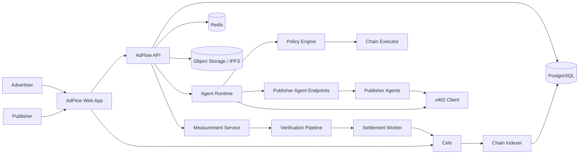
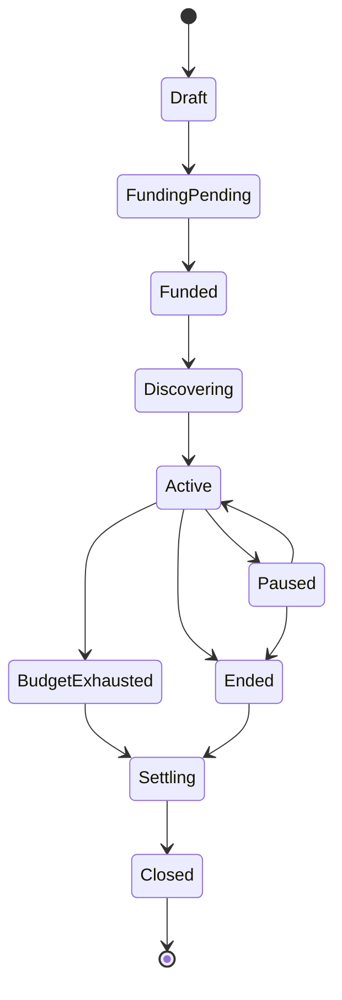
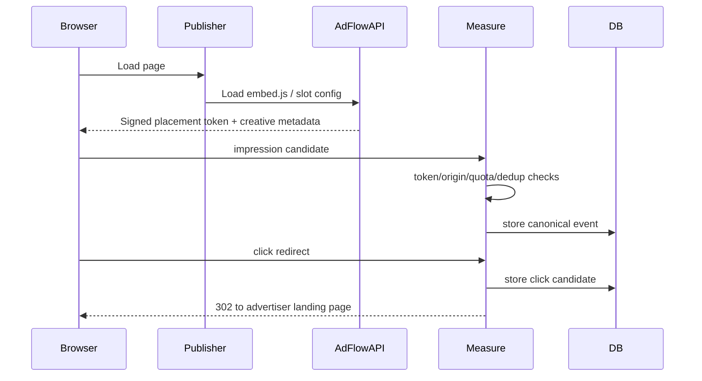
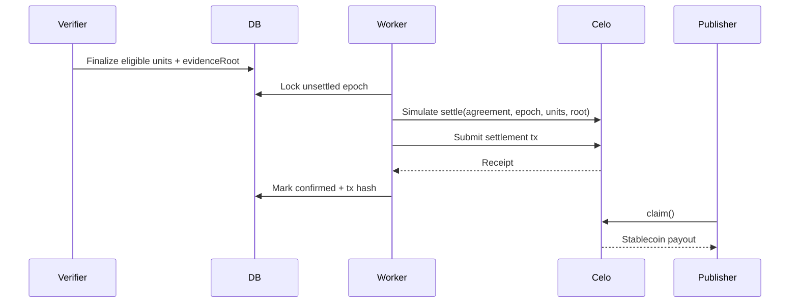
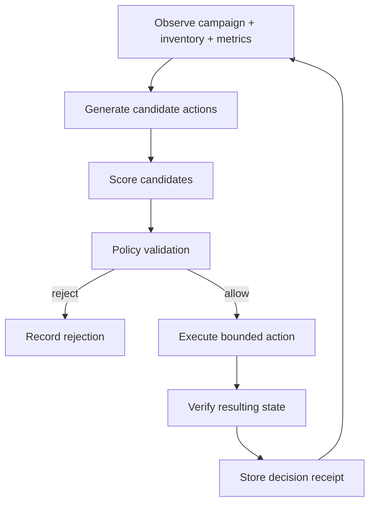

# AdFlow — Architecture

> **Status:** Master architecture specification  
> **Target:** Celo Sepolia first; Celo Mainnet only when explicitly enabled and funded  
> **Product:** Autonomous advertising marketplace where campaign agents discover publisher agents, negotiate bounded placements, measure delivery, and settle publishers in stablecoins on Celo.  
> **Primary hackathon fit:** Most Value Moved, Real World Adoption, Judges' Top Picks  
> **Last architecture review:** 2026-08-29

---

## 1. Executive Summary

AdFlow is an agent-native advertising marketplace built on Celo. An advertiser provides a goal, campaign constraints, creative assets, and a stablecoin budget. A Campaign Agent turns that brief into a bounded execution plan, discovers Publisher Agents, checks identity and reputation, evaluates inventory, proposes or accepts placement agreements, monitors performance, and reallocates spend. Publisher Agents expose machine-readable inventory and placement capabilities. A Verification Agent evaluates measurement evidence and produces deterministic settlement inputs. Celo smart contracts hold campaign escrow, enforce hard financial constraints, prevent replay, calculate settlement amounts, and make publisher earnings claimable.

The system intentionally separates **reasoning** from **authority**:

- LLMs may interpret goals, rank opportunities, explain decisions, and propose actions.
- Deterministic policy code validates every financially relevant action.
- Smart contracts enforce the constraints that must remain true even if the backend or model is wrong.
- Private keys are never exposed to prompts, model context, MCP servers, browser clients, logs, analytics, or databases.
- Measurement acceptance and payout math are not decided by an LLM.

AdFlow is designed as a hybrid system because advertising needs high-volume off-chain measurement and low-cost data processing, while budgets, agreements, identity, reputation references, settlement accounting, and payments benefit from on-chain enforcement.

---

## 2. Product Goal

A user should be able to say:

> “Promote my developer API with 25 USDC. Target AI and blockchain audiences. Maximum CPC is 0.04 USDC. Do not advertise on gambling or adult sites. Optimize for verified clicks for seven days.”

AdFlow should then be able to:

1. create a campaign policy and escrow;
2. create or activate a Campaign Agent;
3. discover eligible Publisher Agents;
4. inspect agent identity, endpoints, capabilities, price ranges, and reputation;
5. request live inventory and negotiate bounded terms;
6. create placement agreements without exceeding campaign limits;
7. issue signed embed/placement authorization;
8. collect impressions and clicks;
9. reject duplicates and suspicious events;
10. settle verified units according to the on-chain agreement;
11. expose every important action in an understandable activity timeline;
12. reallocate remaining budget toward better-performing inventory;
13. stop automatically at budget, deadline, policy breach, or user pause;
14. let publishers claim earnings and advertisers withdraw truly unspent funds.

---

## 3. Core Principles

### 3.1 Agentic, not chatbot-first

The product is not “an ad dashboard plus chat.” The agent must own a real bounded workflow: discovery, evaluation, negotiation, allocation, monitoring, and optimization.

### 3.2 Stablecoins are the economic unit

Campaign budgets, prices, settlement, claimable earnings, and most agent payments use stablecoin atomic units. USDC is the MVP settlement asset. USDT and USDm are follow-on assets after the USDC path is reliable.

### 3.3 On-chain for enforcement, off-chain for throughput

Store data on-chain only when it contributes to economic integrity or portable trust. Raw impressions, browser metadata, creatives, model traces, and analytics stay off-chain.

### 3.4 Deterministic money movement

An LLM never chooses an arbitrary transfer amount. It can propose a publisher, price, or allocation; policy code and contracts independently verify that the action is permitted.

### 3.5 Idempotency everywhere

Every event, agreement, settlement epoch, queue job, chain write, and webhook uses an idempotency key or replay-protection identifier.

### 3.6 Testnet-first and mainnet-gated

Celo Sepolia is the default network for development, CI integration tests, demos, and smoke tests. Mainnet execution is disabled unless an explicit deployment configuration enables it.

### 3.7 Observable autonomy

Users must be able to see what the agent observed, what it decided, what policy allowed, and what actually happened on-chain. We expose concise decision receipts, not hidden chain-of-thought.

---

## 4. Celo-Native Design

AdFlow targets Celo because the system needs cheap, frequent stablecoin interactions and agent-to-agent commerce.

### Celo Mainnet

- Chain ID: `42220`
- Native token: CELO
- Primary settlement asset for AdFlow MVP: USDC
- Optional: USDT, USDm
- Celo fee abstraction may allow approved ERC-20 fee currencies for gas.

### Celo Sepolia

- Chain ID: `11142220`
- Used for development and hackathon demos.
- Treat all token addresses as network-specific configuration, never hard-coded shared constants.

### Celo-specific integrations

1. **ERC-8004 Identity Registry** — portable identity for Campaign and Publisher Agents.
2. **ERC-8004 Reputation Registry** — reputation observations after verified interactions.
3. **x402** — paid machine-to-machine HTTP interactions where immediate request/payment/resource delivery makes sense.
4. **Fee abstraction** — where the selected wallet/client supports it, agents can pay gas using an approved stable asset rather than maintaining separate CELO operational balances.
5. **ERC-8021 attribution tags** — tag AdFlow-generated on-chain activity so hackathon/ecosystem measurement can attribute transactions to AdFlow.
6. **Celo MCP / Celo Agent Skills** — development and optional read-only agent tooling; never the authority boundary for production campaign funds.

---

## 5. System Context



---

## 6. Logical Architecture

AdFlow is divided into nine logical planes.

### 6.1 Experience Plane

The Next.js application handles:

- wallet connection;
- wallet-signature authentication;
- campaign creation;
- publisher onboarding;
- agent marketplace browsing;
- activity timelines;
- campaign analytics;
- settlement and claim UX;
- testnet/mainnet awareness;
- transaction signing that must be performed by the user;
- explainability and approval prompts for actions requiring human authorization.

### 6.2 API Plane

The backend API owns:

- authenticated business APIs;
- normalized data access;
- campaign and publisher metadata;
- signed embed token issuance;
- agent runtime commands;
- agent discovery cache;
- upload policy;
- x402 route metadata and callback handling;
- measurement ingestion;
- public embed configuration;
- admin/ops APIs.

### 6.3 Agent Plane

The Agent Runtime contains:

- Campaign Agent;
- Publisher Agent support services;
- Verification Agent;
- optional Settlement/Operations Agent;
- model gateway;
- tool gateway;
- deterministic planner/executor boundaries;
- memory and decision receipts.

The LLM is a component inside this plane, not the plane itself.

### 6.4 Policy Plane

The policy engine is mandatory before any action that can change campaign spend or publisher assignment.

It checks:

- campaign active state;
- allowed chain;
- allowed token;
- remaining budget;
- per-publisher allocation cap;
- max CPC / max CPM;
- campaign start and end;
- blocked categories/domains;
- publisher reputation threshold;
- quote expiry;
- minimum evidence requirements;
- agent authority;
- rate and velocity caps;
- mainnet safety gates.

### 6.5 Measurement Plane

The measurement stack handles high-volume events off-chain:

- signed embed authorization;
- impression eligibility;
- click redirect measurement;
- origin validation;
- event normalization;
- deduplication;
- rate limiting;
- anomaly signals;
- eligibility decisions;
- evidence retention.

### 6.6 Settlement Plane

The settlement pipeline transforms accepted events into immutable settlement epochs. The worker may submit **units**, but the contract computes the payout using agreed terms. This prevents a compromised worker from choosing arbitrary payout amounts.

### 6.7 Blockchain Plane

Celo stores or enforces:

- campaign escrow;
- campaign owner and authorized operator;
- hard spend limits;
- accepted placement agreement hash/terms;
- settlement replay protection;
- cumulative spend;
- publisher claimable balances;
- withdrawal rules;
- ERC-8004 identity/reputation interactions;
- attribution tags.

### 6.8 Data Plane

PostgreSQL is the source of truth for off-chain application state. Redis is ephemeral acceleration and coordination. Object storage holds creatives and evidence blobs. On-chain state is authoritative for funds and settlement state.

### 6.9 Operations Plane

Includes:

- logs;
- metrics;
- tracing;
- worker dashboards;
- chain/RPC health;
- queue depth;
- settlement drift alerts;
- fraud alert review;
- incident controls;
- feature flags;
- testnet/mainnet deployment gates.

---

## 7. Actors and Agent Types

### 7.1 Advertiser

Owns campaign funds and campaign objectives. The advertiser can pause, resume, change mutable off-chain strategy settings, top up, end, and withdraw remaining funds under contract rules.

### 7.2 Campaign Agent

Represents a single campaign or an advertiser portfolio. It can:

- parse the campaign brief;
- search Publisher Agents;
- query inventory;
- rank opportunities;
- negotiate within policy;
- request agreement creation;
- recommend allocations;
- spend from a tightly bounded operating wallet for x402 services if enabled;
- monitor campaign performance;
- reduce/pause poor inventory;
- create optimization proposals.

It cannot bypass the policy engine or contract controls.

### 7.3 Publisher

Owns one or more sites/apps/slots and the receiving wallet.

### 7.4 Publisher Agent

Represents publisher inventory. It can expose:

- inventory endpoint;
- supported categories;
- accepted pricing models;
- floor prices;
- available formats;
- geographic or audience descriptors;
- placement reservation endpoint;
- analytics endpoint;
- optional x402-paid services.

### 7.5 Verification Agent

Consumes accepted measurement candidates and deterministic fraud features. It produces:

- eligible/rejected state;
- reason codes;
- fraud flags;
- settlement unit aggregates;
- evidence root/hash;
- manual review recommendations.

The Verification Agent must use deterministic rules for financial eligibility. Statistical/ML models may contribute risk scores. LLM output may summarize a decision but must not create payment eligibility.

### 7.6 Settlement Worker

Batches eligible units, verifies agreement state, creates settlement epochs, simulates transactions, and submits them to Celo. It does not calculate a free-form payout amount.

### 7.7 Admin / Operations User

Can manage moderation, pause dangerous infrastructure, review flagged traffic, rotate settlement operators, and inspect failed jobs. Admin power must not include arbitrary withdrawal of user campaign escrow.

---

## 8. On-Chain Architecture

### 8.1 Contract Set

For the hackathon/MVP, keep the contract surface intentionally small.

#### `AdFlowCampaignVault.sol`

Responsibilities:

- create campaign escrow;
- hold ERC-20 campaign funds;
- store hard campaign policy fields;
- authorize an agent operator;
- track committed/spent/remaining values;
- pause/resume/end;
- top up;
- allow owner withdrawal only for uncommitted/unspent funds;
- expose read methods for frontend and agents.

Recommended immutable or strongly constrained fields per campaign:

- `owner`;
- `settlementToken`;
- `pricingModel`;
- `maxUnitPrice`;
- `startAt`;
- `endAt`;
- `agentOperator`;
- `status`;
- optional `maxPublisherAllocation`;
- optional `maxSettlementPerEpoch`.

#### `AdFlowSettlement.sol`

Responsibilities:

- accept signed/authorized placement agreements;
- ensure agreement terms fit the campaign vault limits;
- reserve or account allocated budget;
- store unique agreement IDs/hashes;
- accept settlement epochs from authorized verifier/settlement role;
- reject replayed epoch IDs;
- compute payout from `verifiedUnits × agreedRate / unitScale`;
- cap payout by agreement allocation and remaining campaign budget;
- accrue claimable publisher balances;
- permit publisher claim;
- emit rich events for indexers and attribution.

#### Optional `AdFlowAccessController.sol`

Only split access control out if the two core contracts become difficult to audit. Otherwise use OpenZeppelin roles directly.

### 8.2 Do Not Build a Custom Agent Identity Registry

Use ERC-8004 instead of creating an AdFlow-only identity NFT. AdFlow stores references such as:

- `publisherAgentId`;
- `campaignAgentId`;
- registry network;
- cached registration metadata;
- reputation snapshot used at decision time.

### 8.3 Placement Agreement

A placement agreement should be hashable and signable. Example logical structure:

```text
agreementId
campaignId
publisherAgentId
publisherWallet
slotIdHash
pricingModel
rateAtomic
unitScale
allocationCapAtomic
startAt
endAt
creativePolicyHash
measurementPolicyHash
quoteNonce
quoteExpiry
```

The publisher signs a quote/agreement. The campaign operator accepts it only after the policy engine verifies the terms. The contract verifies that the terms cannot exceed the hard campaign policy.

### 8.4 Settlement Epoch

A settlement epoch is an immutable batch, for example:

```text
epochId = keccak256(agreementId, windowStart, windowEnd, evidenceRoot)
agreementId
windowStart
windowEnd
verifiedUnits
evidenceRoot
```

The settlement amount is derived on-chain.

### 8.5 Claims

Publisher earnings are accrued to `claimable[publisher][token]`. The publisher claims to its registered/approved payout wallet. For MVP, direct claim is preferable to auto-send because it reduces external-call complexity and makes accounting easier to audit.

### 8.6 Contract Invariants

At minimum, tests must prove:

1. `spent + remaining + committed` never exceeds funded campaign value, accounting for released commitments.
2. A settlement epoch cannot execute twice.
3. A placement cannot exceed campaign max rate.
4. A placement cannot settle outside its validity window.
5. Settlements cannot exceed placement allocation cap.
6. Paused/ended campaigns cannot create new spend commitments.
7. Only permitted roles can submit settlement epochs.
8. Settlement operator cannot withdraw campaign funds.
9. Publisher cannot claim more than accrued.
10. Owner cannot withdraw committed or already accrued funds.
11. Token transfer failures revert safely.
12. Reentrancy cannot create double claims or accounting drift.

---

## 9. ERC-8004 Integration

### 9.1 Identity

Each public AdFlow agent may be represented by an ERC-8004 identity. The registration metadata should contain machine-readable endpoints.

Campaign Agent metadata may expose:

- type: campaign-buyer;
- A2A endpoint;
- MCP endpoint if intentionally public;
- wallet endpoint/address;
- supported payment protocols;
- accepted content categories;
- AdFlow protocol version.

Publisher Agent metadata may expose:

- domain ownership information;
- A2A endpoint;
- inventory endpoint;
- formats;
- categories;
- supported pricing models;
- x402 capability;
- wallet endpoint;
- supported trust mechanisms.

### 9.2 Reputation

AdFlow should not write reputation after every browser event. Reputation should represent completed business interactions.

Candidate feedback dimensions:

- `deliverySuccess`;
- `measurementQuality`;
- `settlementReliability`;
- `responseTime`;
- `inventoryAccuracy`;
- `fraudRate` (carefully normalized);
- `reachable`;
- general `starred`/quality score where compatible.

Reputation writes should happen after sufficient evidence and must not expose private campaign data in the feedback URI.

### 9.3 Reputation Snapshotting

When the Campaign Agent selects a publisher, store the reputation snapshot used at that time. This makes later explanations reproducible even if reputation changes.

---

## 10. x402 Integration

x402 is used only for interactions that naturally follow request → payment requirement → payment → resource delivery.

Good AdFlow uses:

- paid premium inventory discovery endpoint;
- placement reservation fee;
- paid publisher analytics API;
- paid verification service from a third-party verifier;
- agent-to-agent data service;
- optional tiny publisher-agent service fees.

Do **not** force delayed CPC/CPM settlement into x402 merely for marketing. Ad delivery is asynchronous and settlement depends on later verification, so the core payout path is better handled by the settlement contract.

### 10.1 Agent Operating Wallet

If x402 spending is enabled, create a separate low-balance execution wallet or smart-account/session-key budget that is not the campaign vault.

Rules:

- funded only with a small operating allowance;
- per-request max amount;
- daily/hourly spend cap;
- approved chain and tokens;
- approved endpoint/domain list or discovered-agent binding;
- no arbitrary wallet transfer tool;
- balance replenishment requires deterministic policy and optionally user approval above threshold.

### 10.2 x402 Receipt Storage

Persist:

- request ID;
- endpoint;
- publisher agent ID;
- payment asset;
- amount;
- transaction hash/authorization reference;
- resource delivered;
- timestamp;
- campaign association;
- policy decision ID.

---

## 11. Celo Fee Abstraction

AdFlow uses `viem` because Celo documentation recommends it for transactions using the `feeCurrency` field.

Rules:

- never assume every stablecoin is currently an allowed fee currency;
- query/configure the current Celo fee-currency allowlist;
- use adapter addresses where required for 6-decimal tokens such as USDC/USDT;
- keep token address and fee-currency adapter address as separate configuration fields;
- simulate transactions before mainnet submission;
- fall back to CELO gas where needed rather than failing silently.

---

## 12. ERC-8021 Attribution

Every AdFlow-originated contract call that supports calldata tagging should append the AdFlow attribution tag.

Implementation requirements:

- configure `ADFLOW_ATTRIBUTION_CODE` per environment;
- use `@celo/attribution-tags`;
- for wagmi writes, use `dataSuffix` where appropriate;
- for backend viem writes, concatenate the encoded suffix to calldata;
- verify at least one smoke-test transaction on each deployment using the verification helper;
- never add a platform attribution code that AdFlow was not assigned or authorized to add.

Store `attributionVerified` on smoke-test/deployment evidence.

---

## 13. Off-Chain Data Architecture

### 13.1 PostgreSQL as Primary Database

Use normalized relational entities because money, agreements, events, epochs, and audit relationships benefit from strong constraints.

Core tables:

- `users`;
- `wallet_sessions`;
- `agents`;
- `agent_endpoints`;
- `agent_reputation_snapshots`;
- `publishers`;
- `publisher_sites`;
- `ad_slots`;
- `campaigns`;
- `campaign_policies`;
- `campaign_creatives`;
- `publisher_quotes`;
- `placement_agreements`;
- `allocation_decisions`;
- `embed_tokens` or token issuance records;
- `measurement_events`;
- `measurement_flags`;
- `verification_batches`;
- `settlement_epochs`;
- `chain_transactions`;
- `publisher_claims`;
- `x402_receipts`;
- `agent_runs`;
- `agent_steps`;
- `policy_decisions`;
- `audit_log`;
- `webhook_inbox`;
- `outbox_events`.

### 13.2 Redis

Use Redis for:

- rate limits;
- short-lived nonce replay protection;
- queue backing;
- hot agent discovery cache;
- short TTL quote cache;
- distributed locks;
- dedup fast path;
- real-time activity feed fanout.

Redis is not the source of truth for funds, campaigns, settlements, or claims.

### 13.3 Object Storage / IPFS

Creatives and public agent registration files may be stored on IPFS or object storage.

Recommended pattern:

- application upload → malware/MIME/size validation → object storage/IPFS → immutable content hash → metadata record;
- do not let browsers upload arbitrary content directly without a signed upload policy;
- use a gateway/CDN abstraction so a single Pinata/IPFS gateway outage does not break serving.

### 13.4 Analytics Store

MVP: aggregate in PostgreSQL using materialized/rollup tables.

Scale path: stream canonical events into ClickHouse or another columnar analytics store without changing settlement source-of-truth semantics.

---

## 14. Authentication and Authorization

### 14.1 Wallet Authentication

Use a SIWE-like wallet-signature flow:

1. frontend requests nonce;
2. backend returns nonce + domain + chain context + expiration;
3. user signs message;
4. backend verifies signature and nonce;
5. backend creates secure session cookie;
6. nonce becomes unusable.

No password authentication is required for MVP.

### 14.2 Roles

Off-chain roles:

- advertiser;
- publisher;
- admin/ops;
- settlement service;
- verifier service.

On-chain roles must be narrower than app roles.

### 14.3 Authorization Rule

Never authorize a request solely because the request body contains a wallet address. Derive the actor wallet from the verified session or verified signature.

---

## 15. Campaign Lifecycle



### Draft

Off-chain campaign configuration can change freely.

### Funding Pending

Contract transaction is created/submitted but not yet confirmed.

### Funded

Escrow exists on Celo. Agent can begin discovery if campaign time permits.

### Discovering

Agent finds and evaluates publisher inventory.

### Active

Serving and measurement are allowed.

### Paused

No new placements; existing serving behavior depends on policy. Default: stop serving new ad responses immediately, settle already-earned eligible units normally.

### Settling

No new spend commitments. Measurement grace period closes, remaining eligible units are settled.

### Closed

Claims can still be processed if funds were accrued, but campaign decisions are immutable.

---

## 16. Publisher Lifecycle

```text
connect wallet
→ create publisher profile
→ verify domain/site ownership
→ register slots
→ configure inventory policy
→ optionally create/register ERC-8004 agent
→ expose agent endpoints
→ receive campaign inquiries
→ sign quotes
→ serve authorized placements
→ receive reputation + earnings
→ claim
```

### Domain verification

At least one:

- DNS TXT challenge;
- `.well-known/adflow-verification.txt`;
- HTML meta tag;
- manual verification for demo-only environments.

Never accept a publisher merely because it claims a domain in JSON.

---

## 17. Agent Discovery and Matching

### 17.1 Candidate Discovery

Sources in priority order:

1. known AdFlow publisher inventory database;
2. ERC-8004 agents tagged/categorized as compatible publisher agents;
3. partner directories or manually curated demo publishers.

### 17.2 Hard Filters

Before model scoring:

- reachable endpoint;
- domain verified;
- supported chain/token;
- compatible pricing model;
- floor price <= campaign max price;
- category allow/block rules;
- time availability;
- reputation minimum;
- settlement capability;
- ad format compatibility.

### 17.3 Scoring

Use deterministic weighted features for the final ranking:

```text
score =
  relevanceWeight * audienceRelevance
+ reputationWeight * reputationScore
+ performanceWeight * historicalPerformance
+ priceWeight * priceEfficiency
+ reliabilityWeight * deliveryReliability
- riskWeight * fraudRisk
```

An LLM may estimate semantic audience relevance from descriptions, but numeric constraints and final eligibility are deterministic.

### 17.4 Exploration vs Exploitation

Use a bounded strategy such as epsilon-greedy or UCB-style allocation later. MVP can use:

- 20% exploration budget across new eligible publishers;
- 80% exploitation toward demonstrated performance;
- minimum evidence threshold before major reallocation;
- maximum shift per optimization cycle.

All percentages are campaign strategy defaults, not contract invariants.

---

## 18. Measurement Architecture

### 18.1 Embed Flow



### 18.2 Signed Embed Token

Contains or binds:

- campaign ID;
- agreement ID;
- slot ID;
- publisher/domain;
- creative ID;
- issued time;
- expiry;
- nonce/key version.

Use HMAC or asymmetric signing. Rotate keys and include a key ID.

### 18.3 Impression Qualification

MVP definition:

- creative loaded successfully;
- browser event received from authorized placement;
- dedup key new within configured window;
- optional viewability: at least 50% in viewport for >=1 second for display ads;
- not rate-limited/blocked;
- agreement active.

Define the exact semantics in versioned `measurementPolicy` metadata so payout rules can be reproduced.

### 18.4 Click Qualification

Clicks should pass through an AdFlow redirect endpoint. Store the event first, then redirect.

Reject or flag:

- duplicate click ID;
- impossible event order;
- click without recent authorized impression where policy requires impression-before-click;
- extreme velocity;
- invalid agreement/token;
- known internal test traffic unless running a flagged smoke test.

### 18.5 Privacy

Do not store raw IP indefinitely. Use short-lived security logs where necessary and derive salted, rotating network/device fingerprints for dedup/risk features. Document retention.

---

## 19. Verification Pipeline

```text
raw candidate
→ schema validation
→ placement-token validation
→ agreement validation
→ dedup
→ timing checks
→ rate/velocity signals
→ publisher/site consistency
→ fraud feature calculation
→ eligible / rejected / flagged
→ settlement aggregation
→ evidence hash/root
```

### Decision states

- `accepted` — counts toward settlement;
- `rejected` — does not count;
- `flagged` — excluded from automatic settlement until resolved;
- `test` — stored for smoke/debug and excluded from production economics unless testnet simulation explicitly allows it.

### Manual Review

Manual review can change off-chain eligibility before an epoch is finalized. After an epoch settles on-chain, corrections require a new explicit adjustment mechanism, never silent database editing.

---

## 20. Settlement Pipeline



### Settlement Safety

Worker process:

1. select finalized, unsettled epoch;
2. acquire distributed lock;
3. load on-chain agreement and campaign state;
4. compare DB expectations with chain state;
5. simulate transaction;
6. submit using settlement operator key;
7. wait for configured confirmation/finality policy;
8. persist receipt;
9. release lock;
10. retry idempotently on transport failures.

If submission state is uncertain, query by transaction nonce/hash before retrying.

---

## 21. Agent Decision Loop



The model can participate in `Generate candidate actions` and semantic scoring. It must not bypass `Policy validation` or `Verify resulting state`.

---

## 22. Chain Indexing and Reconciliation

Do not assume a submitted transaction equals a successful business action.

Indexer responsibilities:

- follow contract events;
- maintain normalized chain transaction records;
- reconcile campaign funded amount;
- reconcile agreement states;
- reconcile settlement epochs;
- reconcile claimable amounts;
- detect reorg/replacement where applicable;
- mark transactions `submitted`, `confirmed`, `reverted`, `replaced`, or `unknown`;
- compare on-chain balances with internal ledger projections.

Daily reconciliation assertion for each campaign:

```text
onChainEscrowBalance
+ cumulativeClaimedOrTransferred
≈ cumulativeDeposited
- validOwnerWithdrawals
```

Use exact integer token units; never floating point for financial values.

---

## 23. API/Agent Protocol Boundaries

### Human-facing API

Authenticated REST/JSON or typed RPC used by the Next.js app.

### Public embed API

Minimal, cacheable, aggressively rate-limited endpoints required by publisher pages.

### Agent-to-Agent API

Versioned machine contract, preferably advertised through ERC-8004 metadata.

Recommended endpoints:

```text
GET  /.well-known/agent.json
GET  /agent/v1/capabilities
GET  /agent/v1/inventory
POST /agent/v1/quotes
POST /agent/v1/agreements/:id/accept
GET  /agent/v1/agreements/:id
GET  /agent/v1/analytics/:agreementId
```

Some endpoints may be x402 protected.

Every A2A mutation requires:

- signed request or wallet-authenticated agent identity;
- nonce;
- timestamp;
- expiry;
- idempotency key;
- body hash;
- replay protection.

---

## 24. Repository Architecture

Recommended monorepo:

```text
adflow/
├── apps/
│   ├── web/                         # Next.js frontend
│   ├── api/                         # Fastify API
│   ├── agent-worker/                # campaign/publisher/verification agent jobs
│   ├── settlement-worker/           # chain settlement queue consumer
│   └── measurement/                 # optional split service; can start inside API
├── packages/
│   ├── contracts/                   # Solidity + Hardhat
│   ├── contract-abis/               # generated ABI/address package
│   ├── chain/                       # viem Celo clients, attribution, token config
│   ├── db/                          # schema/migrations/repositories
│   ├── shared/                      # types, Zod schemas, IDs, constants
│   ├── agent-core/                  # models, tools, policies, planner
│   ├── measurement-core/            # dedup and verification rules
│   ├── ui/                          # reusable components
│   └── config/                      # eslint/tsconfig/env schema
├── scripts/
│   ├── deploy/
│   ├── seed/
│   ├── smoke/
│   └── ops/
├── docs/
│   ├── architecture.md
│   ├── agent.md
│   ├── techstack.md
│   ├── backend.md
│   └── frontend.md
├── docker/
├── .github/workflows/
├── pnpm-workspace.yaml
└── turbo.json
```

For the hackathon, `measurement` may live inside `apps/api` to reduce deployment complexity, but its code must remain a separate module so it can be split later.

---

## 25. Environment Model

### Local

- local Postgres;
- local Redis;
- Celo Sepolia RPC;
- mocked or test model provider optional;
- contract addresses from Sepolia deployment JSON.

### Preview

- isolated DB namespace/project;
- Celo Sepolia;
- no production signing key;
- seeded publisher agents.

### Production Testnet Demo

- dedicated Celo Sepolia contracts;
- real agent registry identities on testnet;
- real x402 testnet path where supported;
- public demo backend.

### Mainnet

Require:

- explicit `NETWORK_MODE=mainnet`;
- explicit mainnet contract addresses;
- separate secrets;
- minimum contract test/audit checklist complete;
- strict policy mode;
- human-controlled pause capability;
- small mainnet caps initially.

Never share a private key across testnet and mainnet.

---

## 26. Security Architecture

### 26.1 Key Management

Separate keys:

- deployer;
- settlement operator;
- verifier/reputation writer if required;
- x402 operating wallet;
- user wallets.

Production keys should be loaded from a secret manager or managed signing service. Never store a private key in PostgreSQL.

### 26.2 LLM Boundary

Never put into model context:

- private keys;
- raw auth cookies;
- bearer tokens;
- database credentials;
- full IP logs;
- unrestricted internal admin tools.

### 26.3 Prompt Injection

Publisher descriptions, websites, creatives, API responses, and agent metadata are untrusted input. Treat instructions inside them as data, not system instructions.

Tool gateway rules:

- allowlisted tool schemas;
- no shell tool in production agent runtime;
- no arbitrary URL fetch without SSRF controls;
- no unrestricted SQL;
- no arbitrary blockchain call;
- no arbitrary token transfer.

### 26.4 SSRF

A2A endpoints are external URLs. Before calling:

- require HTTPS in production;
- resolve DNS and block private/link-local/reserved ranges;
- block redirects to disallowed ranges;
- cap response size;
- enforce timeout;
- content-type/schema validation;
- record endpoint identity.

### 26.5 Smart Contract Security

Use:

- OpenZeppelin `SafeERC20`;
- `ReentrancyGuard` where relevant;
- checks-effects-interactions;
- role separation;
- pull-payment claims;
- pause mechanism;
- typed-data signatures/nonces;
- invariant/fuzz tests;
- static analysis.

Do not implement upgradeability for the hackathon unless absolutely required. Simpler immutable deployments are easier to reason about. If upgradeability is later introduced, governance and timelocks become mandatory design work.

---

## 27. Reliability and Failure Modes

### RPC unavailable

- reads fail over to secondary configured RPC;
- writes stop rather than guessing;
- settlement jobs remain queued;
- frontend reports degraded chain connectivity.

### Model provider unavailable

- serving and existing settlement continue;
- new optimization pauses or uses deterministic fallback;
- no funds are endangered.

### Redis unavailable

- API degrades;
- measurement may temporarily reject or buffer depending on deployment mode;
- no settlement correctness depends solely on Redis.

### PostgreSQL unavailable

- stop new economic actions and measurement acceptance if persistence cannot be guaranteed;
- do not accept “best effort” clicks that cannot be deduplicated safely.

### Publisher endpoint unavailable

- reduce reliability score;
- do not create new allocation;
- existing on-chain earnings remain unaffected.

### Settlement transaction revert

- record revert reason;
- do not mark epoch settled;
- retry only when the cause is transient or state has been reconciled.

---

## 28. Observability

Metrics:

- campaign funded value;
- value allocated;
- value settled;
- value claimed;
- x402 value moved;
- verified impressions/clicks;
- rejected/flagged event rate;
- queue depth;
- settlement lag;
- RPC latency/error rate;
- agent decision latency;
- model cost per campaign;
- publisher endpoint availability;
- chain tx success rate;
- reconciliation drift;
- attributed transaction count.

Every agent action gets a correlation ID that ties together:

```text
agentRunId
→ decisionId
→ policyDecisionId
→ agreementId/x402RequestId
→ queueJobId
→ chainTxHash
```

---

## 29. Test Strategy

### Unit

- policy engine;
- matching/scoring;
- pricing math;
- measurement normalization;
- dedup;
- embed token verification;
- x402 spend limits;
- agent tool validation.

### Contract

- unit tests;
- property/invariant tests;
- fuzz tests;
- role tests;
- malicious ERC-20 assumptions where relevant;
- replay tests.

### Integration

- API + Postgres + Redis;
- agent run with mocked publisher;
- x402 test flow;
- Celo Sepolia contract writes;
- indexer reconciliation.

### E2E

1. connect advertiser wallet;
2. create campaign;
3. fund escrow;
4. start agent;
5. discover publisher;
6. accept placement;
7. render embed;
8. generate a valid impression/click;
9. verify;
10. settle;
11. publisher claim;
12. advertiser pause/withdraw remainder;
13. verify all chain events and attribution.

### Smoke Test Modes

`smoke:testnet` — performs real Celo Sepolia transactions.

`smoke:mainnet-safe` — only enabled with explicit opt-in and tiny configured caps.

---

## 30. Hackathon Demo Flow

The demo should tell one story end-to-end rather than showing disconnected features.

1. Advertiser connects wallet.
2. Enters a natural-language goal and 5–20 USDC-equivalent test/demo budget.
3. UI shows extracted hard policy before funding.
4. Advertiser funds campaign on Celo.
5. Campaign Agent starts.
6. Activity stream shows discovered ERC-8004 Publisher Agents.
7. Agent rejects at least one publisher for a real reason such as price/reputation mismatch.
8. Agent accepts one publisher and records a bounded agreement.
9. Publisher page renders the ad.
10. Real browser impression/click enters measurement pipeline.
11. Verification marks valid event.
12. Settlement worker submits epoch on Celo.
13. Publisher claims stablecoin.
14. UI shows explorer transaction and cumulative “Value Moved by AdFlow.”
15. Agent optimization changes future allocation based on performance.

Optional x402 moment:

- Campaign Agent calls a publisher premium-inventory endpoint;
- receives 402;
- pays a tiny bounded stablecoin amount;
- retries automatically;
- inventory is returned;
- receipt appears in activity stream.

---

## 31. Implementation Waves

### Wave 0 — Foundation

- monorepo;
- env validation;
- PostgreSQL/Redis;
- Celo Sepolia configuration;
- wallet auth;
- contract skeletons;
- CI.

**Exit:** web/API/contracts compile, DB migrates, wallet login works.

### Wave 1 — Marketplace Core

- advertiser campaign CRUD;
- publisher/site/slot onboarding;
- creative upload;
- CampaignVault;
- placement agreements;
- basic deterministic discovery/matching;
- signed embeds;
- basic measurement.

**Exit:** advertiser can fund and serve a placement on Sepolia.

### Wave 2 — Settlement + Agent Economy

- verification pipeline;
- settlement epochs;
- publisher claims;
- Campaign Agent planner;
- Publisher Agent A2A endpoints;
- ERC-8004 identity and reputation read;
- x402 paid endpoint demo;
- agent activity timeline;
- ERC-8021 attribution tags.

**Exit:** autonomous decision causes a real bounded economic action and verified settlement.

### Wave 3 — Hackathon Hardening

- agent reallocation loop;
- reputation writes after interactions;
- mainnet feature gate;
- reconciliation jobs;
- fraud flags/manual review;
- polished explorer links and value-moved dashboard;
- public docs;
- smoke test;
- failure-mode handling;
- demo seeds;
- security review.

**Exit:** repeatable end-to-end demo with no manual database edits.

### Wave 4 — Post-Hackathon Scale

- MiniPay publisher/advertiser experience;
- multiple stablecoins;
- regional currencies;
- advanced fraud/ML;
- external verification agents;
- ClickHouse analytics;
- smart-account/session-key improvements;
- privacy-preserving bidding if economically justified;
- campaign portfolio agents;
- multi-channel placements beyond display ads.

---

## 32. Explicit Non-Goals for MVP

Do not spend hackathon time on:

- custom L1/L2 infrastructure;
- FHE bidding;
- cross-chain settlement;
- complicated bridge routing;
- custom agent identity standard;
- fully decentralized raw event storage;
- real-time programmatic ad exchange compatible with every ad-tech standard;
- complex ML fraud models before deterministic fraud checks work;
- unlimited mainnet autonomy;
- token launch;
- DAO governance;
- arbitrary MCP write access to campaign funds.

---

## 33. Architecture Acceptance Criteria

The architecture is considered implemented for hackathon submission when all are true:

- [ ] Celo Sepolia is the default and documented network.
- [ ] Advertiser can create and fund a campaign in a stablecoin-compatible path.
- [ ] Contract enforces max pricing and budget constraints.
- [ ] Campaign Agent can discover and choose between multiple publisher options.
- [ ] Publisher Agent exposes a machine-readable endpoint.
- [ ] At least one agent has ERC-8004 identity integration.
- [ ] Reputation is read before an agent-to-agent decision.
- [ ] x402 is demonstrated on a real machine-to-machine paid endpoint or explicitly feature-gated if testnet facilitator support blocks it.
- [ ] Measurement uses signed placement authorization and dedup.
- [ ] Verification creates deterministic eligible units.
- [ ] Settlement amount is computed from contract terms, not chosen by an LLM/worker.
- [ ] Replayed settlement epoch fails.
- [ ] Publisher can claim.
- [ ] Advertiser can withdraw only valid unspent funds.
- [ ] Agent activity stream exposes decisions and resulting transactions.
- [ ] ERC-8021 AdFlow attribution is attached and verified on at least one transaction.
- [ ] Full E2E smoke test passes without manual DB mutation.
- [ ] Mainnet is disabled by default.
- [ ] No private key is exposed to the browser, model, logs, or MCP.

---

## 34. Final Architecture Position

AdFlow should be judged as an **autonomous economic coordination system**, not merely an ad marketplace on a blockchain. Celo provides the payment and trust substrate; AdFlow contributes the advertising-specific economic policy, discovery/matching, measurement, verification, and settlement loop.

The key architectural sentence is:

> **Agents choose; policies constrain; contracts enforce; evidence settles.**
