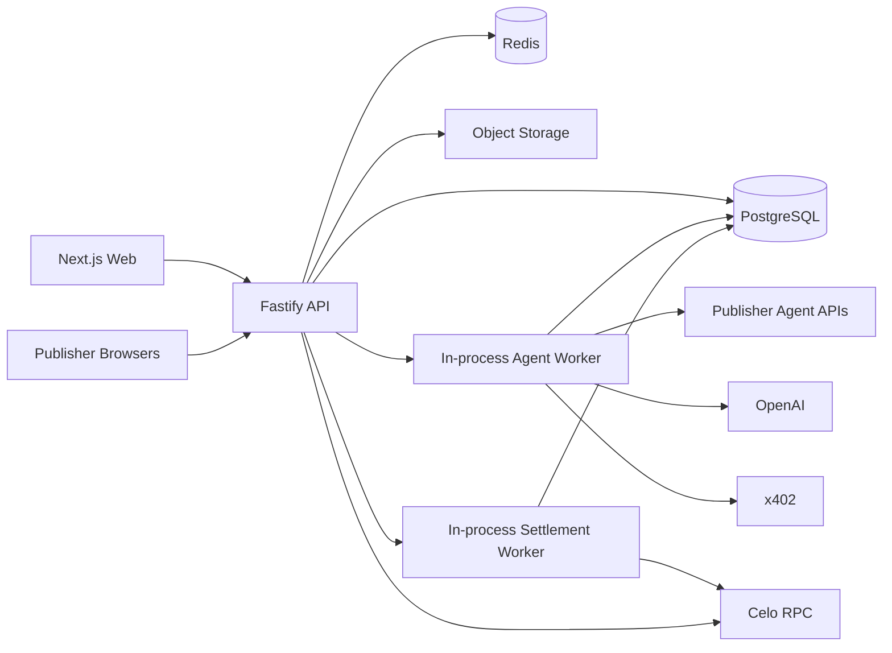

# AdFlow — Backend Specification

> **Backend objective:** Provide a reliable, auditable control plane for advertiser campaigns, publisher inventory, autonomous agents, measurement, verification, and Celo settlement.  
> **Implementation:** Node.js + TypeScript + Fastify + PostgreSQL + Redis/BullMQ + viem.  
> **Default chain:** Celo Sepolia.  
> **Financial rule:** Database state can describe funds; Celo contracts are authoritative for escrow and settlement balances.

---

## 1. Backend Responsibilities

The backend owns six major domains:

1. **Identity and sessions** — wallet-authenticated users and service identities.
2. **Marketplace metadata** — campaigns, creatives, publishers, sites, slots, quotes, agreements.
3. **Agent runtime** — discovery, decision support, policy, activity, A2A/x402 orchestration.
4. **Measurement and verification** — impressions, clicks, dedup, fraud flags, settlement units.
5. **Blockchain operations** — reads, typed writes, transaction tracking, indexing, reconciliation.
6. **Operations** — queues, metrics, audit logs, admin controls, health and failure recovery.

The backend should not be a thin CRUD service. It is the deterministic bridge between off-chain agent reasoning and on-chain financial enforcement.

---

## 2. Service Topology

For the current deployment, run one Fastify modular monolith. API routes and workers are
started in the same process; they remain separate modules so they can scale from the same
artifact if operational volume later requires it.



### `backend/api`

- human-facing APIs;
- public embed endpoints;
- measurement ingestion;
- publisher A2A server routes;
- chain read APIs;
- admin APIs;
- websocket/SSE activity if used.

### In-process campaign worker

- Campaign Agent jobs;
- publisher discovery;
- quote orchestration;
- optimization;
- ERC-8004 metadata/reputation cache refresh;
- optional x402 client calls;
- decision receipts.

### In-process settlement worker

- settlement epoch preparation;
- simulation;
- chain submission;
- transaction reconciliation;
- publisher claim-state indexing;
- ERC-8021 tagging for backend-generated writes.

### `apps/web`

Never receives backend signer secrets.

---

## 3. Backend Module Boundaries

Recommended internal structure:

```text
backend/api/src/
├── app.ts
├── server.ts
├── plugins/
│   ├── auth.ts
│   ├── db.ts
│   ├── redis.ts
│   ├── logger.ts
│   └── request-context.ts
├── modules/
│   ├── auth/
│   ├── users/
│   ├── campaigns/
│   ├── creatives/
│   ├── publishers/
│   ├── slots/
│   ├── agents/
│   ├── discovery/
│   ├── quotes/
│   ├── agreements/
│   ├── embeds/
│   ├── measurement/
│   ├── verification/
│   ├── settlement/
│   ├── chain/
│   ├── x402/
│   ├── reputation/
│   ├── activity/
│   ├── analytics/
│   └── admin/
└── shared/
```

Every module should contain:

```text
routes
schemas
service
repository
errors
unit tests
```

Do not put business logic directly in route handlers.

---

## 4. API Conventions

Base:

```text
/api/v1
```

### Response shape

Success:

```json
{
  "data": {},
  "meta": {
    "requestId": "req_..."
  }
}
```

Error:

```json
{
  "error": {
    "code": "CAMPAIGN_NOT_ACTIVE",
    "message": "Campaign is not active.",
    "details": {}
  },
  "meta": {
    "requestId": "req_..."
  }
}
```

Do not expose stack traces outside development.

### IDs

Use ULID/UUIDv7-style sortable identifiers with domain prefixes at the app layer:

```text
usr_
ses_
agt_
pub_
site_
slot_
cmp_
crt_
qte_
agr_
evt_
vfy_
epc_
tx_
dec_
pol_
run_
```

Database primary keys may be UUID/ULID-native or text. Keep chain IDs/hashes in separate columns.

---

## 5. Authentication

### 5.1 Nonce endpoint

```text
POST /api/v1/auth/nonce
```

Request:

```json
{
  "walletAddress": "0x...",
  "chainId": 11142220
}
```

Response includes:

- nonce;
- message fields;
- expiration;
- allowed domain/URI.

### 5.2 Verify

```text
POST /api/v1/auth/verify
```

Request:

```json
{
  "message": "...",
  "signature": "0x..."
}
```

Backend verifies:

- signature;
- nonce;
- nonce unused;
- domain;
- URI;
- issue time;
- expiry;
- supported chain context.

Then issues secure HTTP-only cookie.

### 5.3 Session

```text
GET /api/v1/auth/session
POST /api/v1/auth/logout
```

### Security

- `HttpOnly`;
- `Secure` in production;
- `SameSite=Lax` or stricter compatible setting;
- CSRF protection on cookie-authenticated mutations where needed;
- session rotation after verification;
- short inactivity/absolute limits appropriate to wallet UX.

---

## 6. User / Wallet Model

A user is not synonymous with a single wallet forever.

MVP can model:

```text
users
wallets
wallet_sessions
```

### `users`

```text
id
created_at
updated_at
```

### `wallets`

```text
id
user_id
address_normalized
address_checksum
first_seen_chain_id
verified_at
is_primary
```

Unique normalized address.

Do not store private keys for user wallets.

---

## 7. Campaign APIs

### Create draft

```text
POST /api/v1/campaigns
```

Fields:

```text
name
objectiveText
landingUrl
pricingModel: CPC | CPM
targeting description/categories
blockedCategories
maxUnitPriceAtomic
settlementToken
budgetPlannedAtomic
startAt
endAt
strategy settings
```

Backend validates but does not claim funding yet.

### List

```text
GET /api/v1/campaigns
```

Filters:

- status;
- owner wallet;
- active/ended;
- token.

### Detail

```text
GET /api/v1/campaigns/:campaignId
```

Returns normalized off-chain campaign plus current on-chain snapshot.

### Update draft

```text
PATCH /api/v1/campaigns/:campaignId
```

Only fields permitted by state can be changed.

### Prepare create/fund transaction

Preferred architecture is frontend-owned user signing. The API can return canonical contract arguments:

```text
POST /api/v1/campaigns/:campaignId/prepare-funding
```

Response:

```json
{
  "chainId": 11142220,
  "token": "0x...",
  "approval": { "required": true, "spender": "0x...", "amount": "..." },
  "contractCall": {
    "address": "0xCampaignVault",
    "functionName": "createCampaign",
    "args": []
  },
  "expectedCampaignHash": "0x..."
}
```

The frontend uses ABI package and wallet to sign.

### Sync funding

Do not trust a client `funded=true` flag. Index chain events or verify tx hash.

```text
POST /api/v1/campaigns/:campaignId/transactions/:txHash/observe
```

This endpoint may enqueue immediate reconciliation; final status comes from chain.

### Pause/resume/end preparation

```text
POST /api/v1/campaigns/:id/prepare-pause
POST /api/v1/campaigns/:id/prepare-resume
POST /api/v1/campaigns/:id/prepare-end
POST /api/v1/campaigns/:id/prepare-withdraw
```

---

## 8. Creative APIs

```text
POST   /api/v1/creatives/upload-url
POST   /api/v1/creatives/complete
GET    /api/v1/creatives/:id
DELETE /api/v1/creatives/:id
POST   /api/v1/campaigns/:id/creatives
```

### Supported MVP creative types

- image PNG/JPEG/WebP;
- plain text/title/body;
- destination URL.

Avoid arbitrary HTML/JS creatives in MVP.

### Validation

- file size;
- MIME sniff;
- extension consistency;
- image dimensions;
- safe URL schemes;
- no javascript URLs;
- destination domain normalization;
- malware scan if available;
- immutable hash.

---

## 9. Publisher APIs

### Profile

```text
POST /api/v1/publishers
GET  /api/v1/publishers/me
PATCH /api/v1/publishers/me
```

### Sites

```text
POST /api/v1/publishers/sites
GET  /api/v1/publishers/sites
POST /api/v1/publishers/sites/:siteId/verification
POST /api/v1/publishers/sites/:siteId/verification/check
```

Verification methods:

- DNS TXT;
- well-known file;
- meta tag.

### Slots

```text
POST   /api/v1/publishers/sites/:siteId/slots
GET    /api/v1/publishers/slots
GET    /api/v1/publishers/slots/:slotId
PATCH  /api/v1/publishers/slots/:slotId
POST   /api/v1/publishers/slots/:slotId/activate
POST   /api/v1/publishers/slots/:slotId/pause
```

Slot fields:

```text
name
format
width/height or responsive rules
placement description
floor CPC
floor CPM
categories
blocked advertiser categories
max campaigns
status
```

---

## 10. Agent APIs

### Create/register internal agent record

```text
POST /api/v1/agents
GET  /api/v1/agents/:agentId
```

### Link ERC-8004 identity

```text
POST /api/v1/agents/:agentId/erc8004/link
```

Request includes chain and transaction/agent reference. Backend verifies on-chain ownership/reference.

### Register preparation

If AdFlow helps create an ERC-8004 identity:

```text
POST /api/v1/agents/:agentId/erc8004/prepare-registration
```

Returns metadata URI preparation and known contract call parameters, but the owning wallet signs.

### Activity

```text
GET /api/v1/campaigns/:campaignId/agent/activity
GET /api/v1/campaigns/:campaignId/agent/runs
GET /api/v1/agent-runs/:runId
```

### Start/stop

```text
POST /api/v1/campaigns/:campaignId/agent/start
POST /api/v1/campaigns/:campaignId/agent/pause
POST /api/v1/campaigns/:campaignId/agent/run-now
```

`run-now` is rate-limited.

---

## 11. Discovery APIs

```text
GET /api/v1/campaigns/:campaignId/candidates
POST /api/v1/campaigns/:campaignId/discovery/run
```

Candidate response:

```json
{
  "publisherAgentId": "agt_...",
  "erc8004": {
    "chainId": 11142220,
    "agentId": "123"
  },
  "publisher": {},
  "slots": [],
  "reputationSnapshot": {},
  "hardFilter": {
    "eligible": true,
    "reasonCodes": []
  },
  "score": {
    "total": 0.81,
    "components": {}
  }
}
```

Do not expose internal anti-fraud signals that would make abuse easier.

---

## 12. Quote APIs

Human/backend-facing:

```text
POST /api/v1/campaigns/:campaignId/quotes/request
GET  /api/v1/campaigns/:campaignId/quotes
GET  /api/v1/quotes/:quoteId
```

A2A publisher endpoint:

```text
POST /agent/v1/quotes
```

Request:

```json
{
  "requestId": "...",
  "buyerAgent": "erc8004:11142220:...",
  "campaignRef": "cmp_...",
  "slotRef": "slot_...",
  "pricingModel": "CPC",
  "maxRateAtomic": "40000",
  "requestedAllocationAtomic": "2000000",
  "startAt": "...",
  "endAt": "...",
  "creativeSummary": {},
  "contentCategories": []
}
```

Publisher response:

```json
{
  "quoteId": "qte_...",
  "slotRef": "slot_...",
  "pricingModel": "CPC",
  "rateAtomic": "28000",
  "unitScale": "1",
  "maxAllocationAtomic": "2000000",
  "validUntil": "...",
  "publisherWallet": "0x...",
  "publisherAgentRef": "erc8004:11142220:...",
  "quoteNonce": "...",
  "signature": "0x..."
}
```

The signature must cover canonical quote data.

---

## 13. Placement Agreement APIs

```text
POST /api/v1/quotes/:quoteId/accept-preview
POST /api/v1/quotes/:quoteId/prepare-agreement
GET  /api/v1/agreements/:agreementId
GET  /api/v1/campaigns/:campaignId/agreements
```

`accept-preview` runs full off-chain policy and gives the UI/agent a deterministic result.

`prepare-agreement` only succeeds after policy allow and builds known contract arguments.

Agent automation path may submit through a typed backend executor if the campaign has authorized a server operator for that action class. The raw private key is not exposed to the agent module.

---

## 14. Public Publisher Agent API

### Well-known metadata

```text
GET /.well-known/agent.json
```

### Capabilities

```text
GET /agent/v1/capabilities
```

### Inventory

```text
GET /agent/v1/inventory
```

Can return free summary and optionally advertise a paid x402 endpoint for premium availability/detail.

### Quotes

```text
POST /agent/v1/quotes
```

### Agreement status

```text
GET /agent/v1/agreements/:agreementId
```

### Aggregate analytics

```text
GET /agent/v1/analytics/:agreementId
```

Only publisher-controlled, privacy-safe aggregate data.

---

## 15. x402 Backend

### x402 protected route example

```text
GET /agent/v1/inventory/premium?slotId=...
```

Without payment:

```text
402 Payment Required
```

After valid x402 settlement:

```json
{
  "availability": {},
  "quoteHints": {},
  "paymentReceipt": {}
}
```

### x402 client module

Responsibilities:

- inspect 402 challenge;
- validate network/token/payee/amount;
- compare payee with publisher identity/quote;
- run policy;
- enforce per-call/daily cap;
- pay using operating wallet;
- retry exactly once with payment proof;
- store receipt;
- detect ambiguous settlement before any retry.

### Mandatory x402 policy checks

```text
network == configured Celo network
asset in allowed x402 tokens
amount <= route limit
amount <= campaign operating budget
amount <= global limit
payee == expected publisher wallet or allowed service wallet
endpoint identity matches discovered agent
challenge not expired
idempotency key unused
MAINNET_ENABLED if chain=42220
```

---

## 16. Embed APIs

### Script

```text
GET /embed/v1/adflow.js
```

Cache aggressively with versioned filename later.

### Slot resolve

```text
GET /embed/v1/slots/:publicSlotKey/ad
```

Inputs may include:

- current page URL/origin;
- viewport hints;
- locale hints.

Backend selects only active authorized agreement for that slot.

Response:

```json
{
  "placementToken": "...",
  "creative": {
    "type": "image",
    "assetUrl": "...",
    "alt": "...",
    "headline": "...",
    "destination": "https://..."
  },
  "measurement": {
    "impressionUrl": "...",
    "clickUrl": "...",
    "viewabilityPolicy": "..."
  }
}
```

Never return advertiser secrets or internal campaign policy.

### Serving selection

MVP selection can be deterministic weighted allocation across active agreements. Record which agreement was selected.

---

## 17. Placement Token

Logical claims:

```text
version
campaignId
agreementId
slotId
publisherSiteId
creativeId
originHash
issuedAt
expiresAt
nonce
keyId
```

Use compact signed token or opaque token referencing server state.

Preferred MVP: HMAC-signed compact payload with key rotation.

### Key rotation

- current signing key;
- previous key accepted for short transition;
- key ID in token;
- secrets only in backend secret manager/env.

---

## 18. Measurement Endpoints

### Impression

```text
POST /measure/v1/impression
```

Payload:

```json
{
  "placementToken": "...",
  "eventId": "client-generated-nonce-or-server-seed",
  "occurredAt": "...",
  "viewability": {
    "visibleRatio": 0.75,
    "visibleMs": 1400
  },
  "page": {
    "origin": "https://publisher.example"
  }
}
```

### Click

Preferred redirect:

```text
GET /measure/v1/click/:clickToken
```

Server:

1. validates token;
2. writes candidate click;
3. schedules verification;
4. returns `302` to allowlisted destination.

Do not accept destination URL from click query parameters without binding it to signed server data.

### Beacon

Use `navigator.sendBeacon` or fetch keepalive for impressions when supported.

---

## 19. Measurement Ingestion Rules

Synchronous fast path:

1. body size/schema;
2. placement token signature;
3. expiry;
4. origin match;
5. basic rate limit;
6. dedup fast check;
7. insert canonical candidate with DB uniqueness;
8. enqueue verification;
9. return 202/204 quickly.

Do not call an LLM or Celo RPC on every impression.

---

## 20. Dedup Design

### Event IDs

Unique database constraint on event ID.

### Semantic dedup

Compute a privacy-preserving key:

```text
hash(
  rotatingSalt,
  agreementId,
  eventType,
  browser/session hints,
  time bucket
)
```

Use Redis for quick detection and Postgres unique/lookup rules for durable correctness.

Do not rely on IP address alone.

---

## 21. Verification Rules

Version rules as code and persist version.

Example:

```text
measurementPolicyVersion = display-v1.0
```

### Impression acceptance

- token valid;
- agreement active;
- creative active;
- publisher origin matches;
- event not duplicate;
- required viewability met;
- velocity under hard block threshold;
- not known smoke/test event in production accounting.

### Click acceptance

- signed click token valid;
- agreement active at click time;
- duplicate pass;
- click velocity pass;
- optional recent impression relation;
- destination bound to creative;
- risk below auto-reject threshold.

### Flagging

Risk rules produce reason codes such as:

```text
DATACENTER_TRAFFIC_SPIKE
IMPOSSIBLE_CLICK_VELOCITY
REPEATED_DEVICE_PATTERN
MISSING_IMPRESSION
PUBLISHER_ORIGIN_MISMATCH
```

Do not reveal exact thresholds publicly.

---

## 22. Settlement Aggregation

For each agreement and closed time window:

```sql
SELECT count(*)
FROM measurement_events
WHERE agreement_id = ?
  AND status = 'accepted'
  AND occurred_at >= ?
  AND occurred_at < ?
  AND settlement_epoch_id IS NULL;
```

The real implementation must lock/mark selected rows transactionally so two workers cannot create overlapping epochs.

### CPC

`verifiedUnits = accepted clicks`.

### CPM

`verifiedUnits = accepted impressions`.

Contract computes:

```text
payout = verifiedUnits * rateAtomic / unitScale
```

For CPM:

```text
unitScale = 1000
```

Define rounding direction in contract and tests. Prefer flooring to avoid overpay due to integer division, while leftover fractional economics accumulate only if explicitly designed. For MVP, choose windows large enough and document rounding.

---

## 23. Settlement Epoch DB Transaction

Within one DB transaction:

1. select eligible unassigned events using lock;
2. calculate units;
3. build ordered event IDs or leaf hashes;
4. calculate evidence root/hash;
5. create epoch with unique `epoch_key`;
6. attach events to epoch;
7. commit;
8. enqueue submit job using epoch ID as queue job ID.

If queue enqueue fails after DB commit, an outbox poller enqueues it later.

---

## 24. Transactional Outbox

Use `outbox_events` for reliable handoff from DB changes to Redis jobs.

Schema:

```text
id
topic
aggregate_type
aggregate_id
payload_json
created_at
published_at
attempts
```

A dispatcher publishes to queues and marks `published_at`.

This prevents “DB committed but queue message lost.”

---

## 25. Settlement Worker

### Job: `settlement.submit`

Inputs:

```text
epochId
```

The worker loads everything else from DB/chain.

Procedure:

1. acquire lock `settlement:epoch:<id>`;
2. return if already chain-confirmed;
3. load epoch/agreement/campaign;
4. read on-chain campaign/agreement state;
5. verify DB/chain IDs and pricing;
6. verify expected contract-computed amount locally for warning only;
7. encode known `settle` call;
8. append ERC-8021 attribution suffix;
9. simulate transaction;
10. submit with settlement signer;
11. persist tx hash and signer nonce;
12. wait/query receipt;
13. mark confirmed/reverted;
14. emit activity event.

### Retry categories

Retry:

- RPC timeout;
- temporary rate limit;
- temporary network error.

Do not blind retry:

- contract revert due to policy;
- invalid agreement;
- insufficient escrow;
- epoch already settled;
- mismatched state.

Reconcile first.

---

## 26. Chain Transaction Table

```text
id
chain_id
kind
entity_type
entity_id
from_address
to_address
nonce
hash
status
submitted_at
confirmed_at
block_number
revert_reason
replacement_hash
data_hash
attribution_expected
attribution_verified
raw_receipt_json_redacted
```

Do not persist private signing material.

---

## 27. Chain Indexer

For hackathon, a polling/log indexer is enough.

Track contract events from deployment block:

```text
CampaignCreated
CampaignFunded
CampaignPaused
CampaignResumed
CampaignEnded
AgreementAccepted
SettlementRecorded
PublisherClaimed
CampaignWithdrawn
```

### Cursor

```text
chain_index_cursors
chain_id
contract_address
last_finalized_block
```

Process blocks idempotently. Unique key on `(chain_id, tx_hash, log_index)`.

---

## 28. Reconciliation Jobs

Run periodically and after suspicious errors.

### Campaign reconciliation

Compare:

- DB funded;
- chain funded;
- DB committed;
- chain committed;
- DB settled;
- chain spent/accrued;
- DB withdrawal;
- chain withdrawal.

### Settlement reconciliation

- epoch DB status vs on-chain replay key;
- tx status;
- expected units;
- contract event amount.

### Claim reconciliation

- claimable snapshot;
- claims emitted;
- publisher wallet.

Any financial mismatch creates high-priority ops alert and blocks new economic actions for the affected campaign if needed.

---

## 29. PostgreSQL Schema — Core Tables

The exact SQL may evolve; the following relationships are architectural requirements.

### `campaigns`

```text
id PK
owner_user_id FK
owner_wallet_id FK
name
objective_text
landing_url
pricing_model
settlement_token_symbol
settlement_token_address
budget_planned_atomic NUMERIC(78,0) or bigint-safe representation
max_unit_price_atomic
start_at
end_at
status
onchain_campaign_id
chain_id
created_at
updated_at
```

### `campaign_policies`

```text
campaign_id PK/FK
allowed_categories JSONB
blocked_categories JSONB
blocked_domains JSONB
min_reputation_score
max_publisher_allocation_atomic
exploration_ratio_basis_points
optimization_interval_seconds
mainnet_approval_threshold_atomic
version
```

### `publishers`

```text
id PK
owner_user_id
payout_wallet_id
name
status
created_at
```

### `publisher_sites`

```text
id
publisher_id
origin
normalized_domain
verification_method
verification_challenge_hash
verified_at
status
UNIQUE(publisher_id, normalized_domain)
```

### `ad_slots`

```text
id
site_id
public_key UNIQUE
name
format
width
height
floor_cpc_atomic
floor_cpm_atomic
status
categories JSONB
policy_version
```

### `agents`

```text
id
owner_user_id nullable
role
name
status
erc8004_chain_id
erc8004_registry_address
erc8004_agent_id
erc8004_uri
wallet_address
protocol_version
created_at
```

### `agent_endpoints`

```text
id
agent_id
endpoint_type
url
verified_at
last_health_at
last_health_status
```

### `agent_reputation_snapshots`

```text
id
agent_id
chain_id
source_registry
average_score
feedback_count
raw_summary_json
observed_block
observed_at
```

### `publisher_quotes`

```text
id
campaign_id
publisher_agent_id
slot_id
pricing_model
rate_atomic
unit_scale
max_allocation_atomic
publisher_wallet
quote_nonce
valid_until
signature
canonical_hash UNIQUE
status
```

### `placement_agreements`

```text
id
campaign_id
quote_id
publisher_agent_id
slot_id
pricing_model
rate_atomic
unit_scale
allocation_cap_atomic
start_at
end_at
agreement_hash UNIQUE
onchain_agreement_id
status
accepted_tx_hash
```

### `measurement_events`

High-volume table; partition later by date.

```text
id
event_key UNIQUE
agreement_id
event_type
occurred_at
received_at
placement_token_id/hash
origin_hash
session_dedup_hash
viewability_ratio nullable
viewability_ms nullable
risk_score nullable
status
measurement_policy_version
settlement_epoch_id nullable
metadata_json limited/redacted
```

### `measurement_flags`

```text
id
event_id
code
severity
details_json_redacted
created_at
resolved_at
resolution
```

### `settlement_epochs`

```text
id
agreement_id
epoch_key UNIQUE
window_start
window_end
verified_units
evidence_root
status
chain_tx_id
onchain_amount_atomic nullable
created_at
confirmed_at
```

### `x402_receipts`

```text
id
campaign_id nullable
agent_id
publisher_agent_id nullable
endpoint
request_method
idempotency_key UNIQUE
chain_id
asset_address
amount_atomic
payee_address
payment_reference
transaction_hash nullable
status
created_at
```

### `agent_runs`

```text
id
agent_id
campaign_id nullable
trigger_type
status
model_provider
model_name
prompt_version
started_at
completed_at
error_code
```

### `agent_steps`

```text
id
run_id
sequence
step_type
input_hash
output_hash
status
started_at
completed_at
```

### `policy_decisions`

```text
id
campaign_id
action_type
action_hash
decision
reason_codes JSONB
effective_limits JSONB
campaign_state_version
created_at
```

### `activity_events`

```text
id
campaign_id nullable
publisher_id nullable
actor_type
actor_id nullable
event_type
title
summary
entity_type
entity_id
chain_tx_hash nullable
created_at
visibility
```

### `audit_log`

Append-only logical audit table.

```text
id
request_id
actor_type
actor_id
action
entity_type
entity_id
before_hash
after_hash
ip_security_hash nullable
created_at
```

---

## 30. Database Constraints

Critical examples:

- unique event key;
- unique epoch key;
- unique quote canonical hash/nonce per publisher;
- unique on-chain log key;
- positive monetary amounts;
- `end_at > start_at`;
- accepted agreement quote must reference same campaign/slot/publisher;
- status transitions enforced in service and optionally DB checks;
- no cascade delete on financial history.

Use soft archive/status for economic entities instead of destructive deletion.

---

## 31. Analytics APIs

### Campaign summary

```text
GET /api/v1/campaigns/:id/analytics/summary
```

Returns:

- funded;
- committed;
- settled;
- remaining;
- impressions;
- verified impressions;
- clicks;
- verified clicks;
- CTR;
- effective CPC;
- active publishers;
- rejected event rate;
- value moved.

### Time series

```text
GET /api/v1/campaigns/:id/analytics/timeseries?metric=clicks&interval=hour
```

Use aggregate tables for larger datasets.

### Publisher earnings

```text
GET /api/v1/publishers/earnings
GET /api/v1/publishers/earnings/agreements
GET /api/v1/publishers/claims
```

---

## 32. Activity APIs

```text
GET /api/v1/campaigns/:id/activity?cursor=...
GET /api/v1/publishers/activity?cursor=...
```

Activity is user-readable operational truth, not raw logs.

Event examples:

```text
CAMPAIGN_FUNDED
AGENT_STARTED
PUBLISHERS_DISCOVERED
PUBLISHER_FILTERED
QUOTE_RECEIVED
QUOTE_REJECTED
AGREEMENT_ACCEPTED
X402_PAYMENT_COMPLETED
AD_SERVED
VERIFIED_CLICK_BATCH
SETTLEMENT_SUBMITTED
SETTLEMENT_CONFIRMED
PUBLISHER_CLAIMED
ALLOCATION_INCREASED
CAMPAIGN_PAUSED
```

---

## 33. Admin APIs

Restricted and audited.

```text
GET  /api/v1/admin/health/financial
GET  /api/v1/admin/settlements/failed
POST /api/v1/admin/settlements/:id/reconcile
GET  /api/v1/admin/measurement/flags
POST /api/v1/admin/measurement/flags/:id/resolve
POST /api/v1/admin/publishers/:id/suspend
POST /api/v1/admin/emergency/disable-agent-writes
```

Admin must not have an endpoint like:

```text
POST /admin/send-money-anywhere
```

Emergency actions should pause new actions, not seize user escrow.

---

## 34. Rate Limiting

Separate policies:

### Auth

Strict by IP/security hash and wallet.

### Public embed

High allowance but origin-aware.

### Measurement

Per token/slot/origin/network fingerprint.

### Agent A2A

Per verified agent identity and IP.

### Expensive model endpoints

Per campaign/user.

### Admin

Very strict; require authenticated role and optionally VPN/allowlist for production.

---

## 35. SSRF Protection for Agent Calls

External publisher endpoints are attacker-controlled.

Resolver must:

- only allow `https` in production;
- reject credentials in URL;
- reject localhost;
- reject RFC1918/private ranges;
- reject link-local and cloud metadata ranges;
- resolve DNS before request and after redirects;
- limit redirects;
- cap body bytes;
- enforce connect/read timeout;
- validate JSON content type/schema;
- log host and resolved IP security hash.

Consider egress proxy in later production.

---

## 36. Signing Key Architecture

### Deployer key

Only deployment scripts/CI secure environment.

### Settlement operator

Only settlement worker process.

### x402 operating wallet

Only agent executor payment module. Small balance.

### Publisher quote signer

For AdFlow-hosted publisher agents, either:

- publisher-owned wallet signs quotes client-side; or
- a publisher-authorized agent signer signs, with explicit binding.

Never use one global backend key as every publisher's identity.

---

## 37. Secret Management

Development:

- local `.env` ignored by Git.

Production:

- platform secret store/KMS;
- no secrets in Docker image;
- rotation procedure;
- separate environments;
- redact process logs.

Start-up env schema should reject obvious unsafe combinations, e.g.:

```text
CELO_NETWORK=celo
MAINNET_ENABLED=false
```

means chain-write worker must refuse mainnet writes.

---

## 38. Logging

Structured JSON:

```json
{
  "level": "info",
  "requestId": "req_...",
  "campaignId": "cmp_...",
  "agentRunId": "run_...",
  "event": "settlement_submitted",
  "txHash": "0x..."
}
```

Do not log full raw measurement payloads by default.

---

## 39. Health Endpoints

```text
GET /health/live
GET /health/ready
```

Readiness checks:

- Postgres;
- Redis;
- required config;
- optionally Celo read RPC.

Do not fail liveness merely because external model provider is down; agent features can be degraded while serving/settlement remains healthy.

---

## 40. Mainnet Safety Gate

Before any backend-signed mainnet transaction:

```text
MAINNET_ENABLED == true
STRICT_POLICY_MODE == true
chainId == 42220
contract address is known mainnet deployment
signer environment == mainnet
amount <= configured global cap
campaign mainnet flag == true
policy decision valid and unexpired
simulation successful
```

Fail closed.

---

## 41. API Idempotency

Mutating financial-adjacent endpoints accept:

```text
Idempotency-Key: <uuid>
```

Store response/result for reasonable TTL or durable entity binding.

Required for:

- quote requests;
- agreement preparation/submission commands;
- x402 operations;
- settlement manual retries;
- claim observation;
- campaign create requests from unstable mobile networks.

---

## 42. Concurrency Strategy

Use DB transactions and row locks for:

- campaign allocation updates;
- settlement epoch creation;
- claim projections;
- quote acceptance state;
- outbox creation.

Use Redis distributed locks only for process coordination where DB locking is not the authoritative correctness mechanism.

---

## 43. Eventual Consistency UX Contract

Chain actions may pass through:

```text
prepared
→ wallet_prompt
→ submitted
→ confirmed
```

The API and frontend must represent these separately.

Never change a campaign to `FUNDED` only because the wallet returned a tx hash.

---

## 44. Performance Targets for MVP

Reasonable engineering targets:

- authenticated CRUD p95 < 300 ms excluding chain/model calls;
- public slot resolution p95 < 200 ms from backend region/cache;
- impression ingestion p95 < 100–150 ms server processing under demo load;
- click redirect adds minimal latency, target < 150 ms backend processing;
- no model call in serving/measurement hot path;
- queue-based agent and settlement work;
- database indexes proven by query plans for high-volume endpoints.

These are targets, not guaranteed SLA claims.

---

## 45. Caching

Cache:

- public agent metadata;
- reputation summaries for short TTL;
- slot config;
- contract static metadata;
- token metadata.

Do not cache as authoritative:

- remaining campaign funds for financial validation;
- settlement replay state;
- user authorization;
- claimable amount immediately before a financial write.

Always re-read canonical DB/chain state for execution.

---

## 46. Background Schedules

Suggested jobs:

```text
agent optimization: every 10–30 min demo, configurable
publisher endpoint health: every 5–15 min
chain index: continuous/poll every few sec
settlement epoch close: 1–5 min demo or threshold based
reconciliation: every 15–60 min + event-driven
reputation refresh: 15–60 min
stale quote cleanup: every few min
object cleanup: daily
```

Do not settle thousands of single impressions individually for CPM; batch meaningful windows.

---

## 47. Testing Backend

### Unit

- schemas;
- domain services;
- policy;
- auth nonce;
- token math;
- quote canonicalization;
- evidence hashing;
- SSRF URL validation;
- idempotency.

### Integration

- Fastify inject + Postgres;
- Redis/BullMQ;
- transaction outbox;
- measurement duplicate races;
- settlement epoch concurrent creation.

### Celo Sepolia

- create/fund campaign;
- accept agreement;
- settle;
- claim;
- pause;
- withdraw;
- attribution verify.

### Security

- signature replay;
- nonce replay;
- x402 replay;
- malformed publisher endpoints;
- private IP SSRF;
- prompt injection payload stored in publisher description;
- over-budget agent proposal;
- duplicate settlement queue delivery.

---

## 48. Smoke Test

Root command:

```bash
pnpm smoke:testnet
```

Expected real flow:

1. ensure Sepolia config;
2. seed advertiser/publisher test wallets;
3. create publisher/site/slot;
4. register or attach publisher agent;
5. create campaign;
6. fund contract;
7. run discovery;
8. request quote;
9. accept agreement;
10. resolve embed;
11. submit real synthetic-marked demo measurement;
12. verify;
13. create epoch;
14. settle on Celo Sepolia;
15. claim;
16. verify DB/chain reconciliation;
17. verify attribution suffix where applicable;
18. print transaction hashes and final accounting.

Synthetic smoke measurements must be explicitly marked as demo/test in the test environment; never mix with production-ad quality metrics.

---

## 49. Backend Definition of Done

- [ ] Wallet session auth works without passwords.
- [ ] Postgres schema and migrations are committed.
- [ ] Publisher domain verification exists.
- [ ] Campaign state cannot be marked funded from client assertion.
- [ ] Agent jobs use durable queues.
- [ ] External A2A calls are SSRF-protected.
- [ ] Quote signatures/nonces are verified.
- [ ] Agreement policy validation is deterministic.
- [ ] Measurement hot path contains no LLM/chain call.
- [ ] Event dedup has durable DB protection.
- [ ] Verification rules are versioned.
- [ ] Settlement epochs cannot overlap/double-assign events.
- [ ] Worker uses typed contract calls and simulation.
- [ ] Backend signer cannot arbitrarily withdraw campaign escrow.
- [ ] ERC-8021 tagging is applied to AdFlow-originated writes.
- [ ] Chain indexer and reconciliation exist.
- [ ] x402 has strict amount/payee/network/idempotency checks.
- [ ] Mainnet writes fail closed unless explicitly enabled.
- [ ] Testnet smoke flow completes without manual DB edits.
