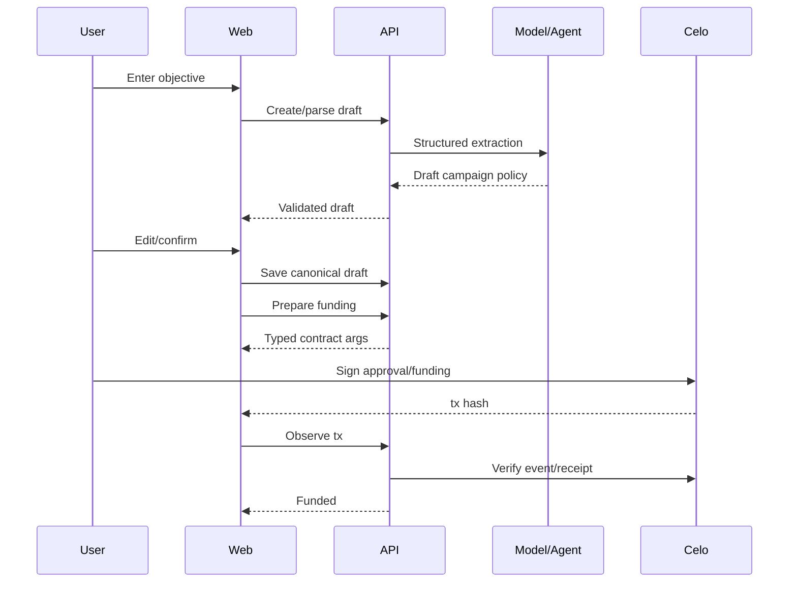
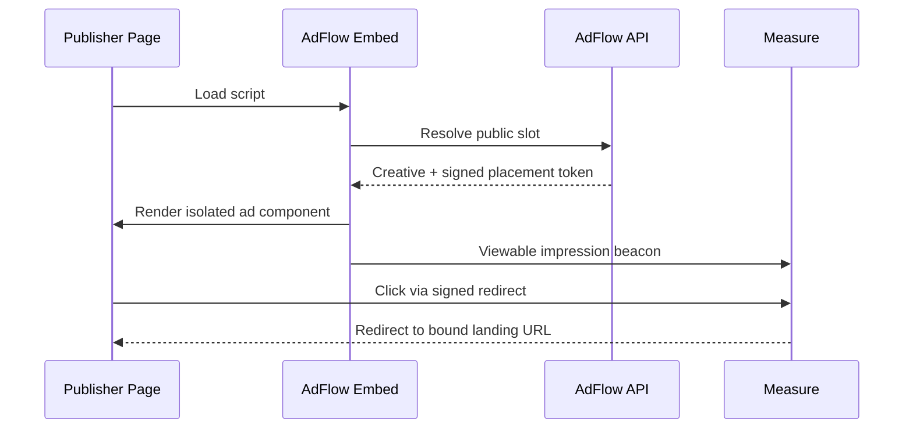

# AdFlow — Frontend Specification

> **Frontend objective:** Make autonomous agent activity, stablecoin movement, publisher inventory, measurement, and settlement understandable without reducing AdFlow to a chat UI.  
> **Framework:** Next.js App Router + TypeScript + Tailwind + shadcn/ui + wagmi + viem + RainbowKit-compatible wallet UX.  
> **Design direction:** premium, calm, data-forward, high contrast, not “AI neon,” not a generic crypto dashboard.

---

## 1. Frontend Product Principles

### 1.1 The agent is visible through actions

The primary proof of intelligence is the activity timeline and changing campaign state, not a large chat box.

### 1.2 Money must always be legible

At every point show:

- token;
- funded amount;
- committed/allocated amount;
- settled amount;
- claimable amount where relevant;
- remaining/unspent amount;
- network.

Never display ambiguous `$5` when token/network matters. Good display:

```text
5.00 USDC · Celo Sepolia
```

### 1.3 Every chain action has explicit lifecycle

```text
Review → Sign → Submitted → Confirmed
```

A tx hash is not confirmation.

### 1.4 Autonomy must feel controlled

The UI shows the campaign's hard limits near agent activity:

```text
Budget       20 USDC
Max CPC      0.04 USDC
Ends         Sep 5
Network      Celo Sepolia
Autonomy     Bounded
```

### 1.5 Explain without exposing hidden reasoning

Show reason codes and facts:

> “Publisher rejected: quoted CPC 0.052 exceeds your 0.040 maximum.”

Do not show or request private chain-of-thought.

### 1.6 Desktop-first for hackathon, responsive by construction

The marketplace/analytics demo benefits from desktop width. Build responsive layouts from the start so MiniPay/mobile expansion is feasible later.

---

## 2. Information Architecture

```text
/
/app
/app/onboarding
/app/campaigns
/app/campaigns/new
/app/campaigns/[campaignId]
/app/campaigns/[campaignId]/publishers
/app/campaigns/[campaignId]/activity
/app/campaigns/[campaignId]/analytics
/app/campaigns/[campaignId]/settlements
/app/publisher
/app/publisher/onboarding
/app/publisher/sites
/app/publisher/slots
/app/publisher/agent
/app/publisher/earnings
/app/agents
/app/agents/[agentId]
/app/account
/app/settings
/app/admin                # role gated
/docs
/embed-demo               # optional hackathon demo publisher page
```

Do not create dozens of separate pages if the campaign detail can use stable tabs/sections. Route structure may map some sections to tab state while preserving deep-linkability.

---

## 3. Global Shell

### Desktop

```text
┌────────────────────────────────────────────────────────────────────┐
│ AdFlow       Celo Sepolia ●          Search      Wallet / Account │
├──────────────┬─────────────────────────────────────────────────────┤
│ Overview     │                                                     │
│ Campaigns    │                  page content                       │
│ Publisher    │                                                     │
│ Agents       │                                                     │
│ Activity     │                                                     │
│ Account      │                                                     │
│              │                                                     │
│ Docs         │                                                     │
└──────────────┴─────────────────────────────────────────────────────┘
```

### Mobile

- top app bar;
- compact network indicator;
- bottom/tab navigation for primary areas;
- wallet sheet;
- activity drawer.

---

## 4. Visual System

### Tone

AdFlow should look like a serious autonomous marketplace, not a memecoin product.

Use:

- neutral background;
- strong typography hierarchy;
- restrained Celo/AdFlow accent;
- subtle state colors;
- precise number alignment;
- thin borders;
- compact but breathable data cards;
- modest motion only when showing state transitions.

### Avoid

- excessive gradients;
- glowing AI brains;
- robot illustrations everywhere;
- animated backgrounds;
- giant glassmorphism cards;
- fake live trading visuals;
- crypto jargon where plain language works.

---

## 5. Design Tokens

Use CSS variables so theme decisions remain centralized.

```text
--background
--foreground
--muted
--muted-foreground
--card
--border
--primary
--primary-foreground
--success
--warning
--danger
--info
--chain-celo
```

Do not encode status solely by color. Pair color with icon/text.

---

## 6. Wallet and Network UX

### Wallet connection

Use RainbowKit/wagmi or equivalent connector UX.

Supported MVP wallet behavior:

- injected browser wallets;
- WalletConnect-compatible flows as configured;
- Celo Sepolia and Celo Mainnet network awareness.

### Network rule

If wrong network:

```text
You're connected to Ethereum Mainnet.
AdFlow is currently using Celo Sepolia.
[Switch to Celo Sepolia]
```

Disable economic actions until switch completes.

### Mainnet warning

When mainnet is enabled:

```text
Celo Mainnet · Real funds
```

Use persistent but non-obstructive indicator. Before first real-fund campaign transaction in a session, show a confirmation panel with exact token/amount.

### Address display

Show:

```text
0x12ab…90ef
```

with copy and explorer action. Never replace the address completely with an unverified display name.

---

## 7. Authentication UX

Connection and authentication are separate concepts.

Flow:

```text
Connect wallet
→ Sign in to AdFlow
→ nonce/signature message
→ authenticated session
```

Copy should explain:

> “This signature verifies wallet ownership. It does not spend funds.”

Never make a login signature look like a transaction.

---

## 8. Landing Page `/`

The landing page should explain the marketplace in one screen.

Hero:

> **AI agents that buy and sell attention with stablecoins.**

Subtext:

> Give a Campaign Agent a goal and spending limits. It finds publisher agents, evaluates reputation, negotiates inventory, monitors verified delivery, and settles publishers on Celo.

Primary CTAs:

- `Launch a campaign`
- `Monetize as a publisher`

### Hero visualization

Use a compact flow, not a decorative AI image:

```text
Your goal + USDC
       ↓
Campaign Agent
   ↙   ↓   ↘
Publisher Agents
       ↓
Verified delivery
       ↓
Celo settlement
```

### Proof section

Live/testnet stats if available:

- campaigns launched;
- agent decisions;
- verified events;
- stablecoin value settled;
- registered publisher agents.

Label testnet data clearly.

---

## 9. App Home `/app`

Role-aware dashboard.

If user has advertiser activity:

- total campaign balance;
- active campaigns;
- settled value;
- agent actions today;
- performance trend;
- recent activity.

If publisher:

- active slots;
- claimable earnings;
- settled earnings;
- active agreements;
- agent health.

If both, show a role switch or combined summary without hiding either side.

### Main dashboard cards

Keep to 4–6 primary metrics. Do not create 20 vanity cards.

---

## 10. Campaign Creation `/app/campaigns/new`

This is a critical demo surface.

### Step 1 — Describe the goal

Large input:

```text
Promote api.example.dev to AI/blockchain developers.
Budget 20 USDC for 7 days.
Optimize for verified clicks.
Maximum CPC 0.04 USDC.
Avoid gambling and adult sites.
```

CTA:

```text
Build campaign plan
```

The model parses a **draft** only.

### Step 2 — Review structured policy

Left: objective text.  
Right: extracted hard settings.

```text
Objective
Promote developer API

Settlement
CPC

Budget
20.00 USDC

Maximum CPC
0.040 USDC

Duration
7 days

Categories
AI, Developer Tools, Blockchain

Blocked
Gambling, Adult

Autonomy
Bounded testnet autonomy
```

Every material field is editable before funding.

### Step 3 — Creative

Fields:

- headline;
- short body;
- image;
- alt text;
- landing URL;
- preview.

Use exact image aspect/size guidance for supported slot types.

### Step 4 — Agent controls

Show strategy settings with good defaults:

```text
Minimum publisher reputation
Publisher concentration limit
Exploration budget
Optimization frequency
```

Hide advanced details under `Advanced` so normal users are not overwhelmed.

### Step 5 — Fund

Summary:

```text
Campaign budget     20.00 USDC
Network             Celo Sepolia
Max CPC             0.040 USDC
Ends                Sep 5, 2026
```

Transaction UX may require:

1. approve USDC if necessary;
2. create/fund campaign contract call.

Show each separately.

### Step 6 — Agent starts

After chain confirmation:

```text
Campaign funded
Agent starting discovery…
```

Navigate to campaign detail with live activity.

---

## 11. Campaign Detail `/app/campaigns/[campaignId]`

This is the main product surface.

Header:

```text
Developer API Launch          ACTIVE
20.00 USDC budget · CPC · Celo Sepolia
```

Actions:

- Pause;
- Resume;
- Top up;
- End campaign;
- Withdraw unspent when allowed;
- View explorer.

### Top metrics

```text
Funded
Committed
Settled
Remaining
Verified clicks
Effective CPC
```

### Main two-column layout

Desktop:

```text
┌──────────────────────────────────────┬────────────────────────────┐
│ Campaign performance                 │ Agent activity             │
│ chart + publisher allocation         │ live timeline              │
│                                      │                            │
├──────────────────────────────────────┼────────────────────────────┤
│ Active agreements                    │ Policy                     │
│                                      │ budget/max CPC/etc         │
└──────────────────────────────────────┴────────────────────────────┘
```

On mobile, activity becomes a tab or stacked section.

---

## 12. Agent Activity Timeline

The activity timeline is the visual signature of AdFlow.

Event card fields:

```text
time
actor
icon/status
title
short explanation
reason badges
value if economic
publisher if applicable
transaction link if applicable
expandable evidence/details
```

Examples:

```text
12:03 · Campaign Agent
5 publisher agents discovered
3 passed campaign hard filters.

12:04 · Policy
Publisher #184 rejected
Quote 0.052 USDC/click > campaign maximum 0.040.

12:05 · Campaign Agent
Allocation proposed
Publisher #392 · 2.00 USDC · quoted CPC 0.028.

12:05 · Policy
Proposal allowed
Budget OK · price OK · reputation threshold met.

12:06 · Celo
Placement agreement confirmed
0x9f…21ab ↗

12:18 · Verification
4 new clicks accepted
1 duplicate rejected.

12:21 · Celo
Settlement confirmed
0.112 USDC accrued to publisher.
```

### Live updates

Use Server-Sent Events or short polling/React Query invalidation. SSE is sufficient for hackathon if deployment supports long-lived connections.

### Never display

- hidden reasoning;
- raw model prompt;
- secrets;
- private fraud thresholds.

---

## 13. Campaign Policy Panel

Persistent compact panel:

```text
Hard limits
Budget            20 USDC
Max CPC           0.04 USDC
End               Sep 5
Token             USDC
Network           Celo Sepolia
Blocked           Gambling, Adult

Strategy
Exploration       20%
Publisher cap     30%
Optimize          every 15m
```

Mark which settings are on-chain hard limits versus off-chain strategy.

Example badges:

```text
On-chain
Strategy
```

---

## 14. Publisher Candidates Page

`/app/campaigns/[id]/publishers`

Table/cards:

```text
Publisher
Agent identity
Domain
Formats
Quote
Reputation
Historical performance
Risk
Status
Why selected/rejected
```

Controls:

- eligible only;
- quoted;
- active;
- rejected;
- search domain;
- sort by score/price/reputation.

### Candidate drawer

Shows:

- verified domain;
- ERC-8004 agent reference;
- endpoint health;
- reputation summary;
- quote terms;
- slot details;
- reason score components;
- active agreement/history;
- explorer links.

---

## 15. Agent Marketplace `/app/agents`

Public-ish browse surface for compatible publisher agents.

Cards should emphasize business capability:

```text
Example.dev
Publisher Agent #184
Developer Tools · AI
CPC from 0.025 USDC
Display / Native-style image
Reputation 88/100
Endpoint healthy
```

Filters:

- category;
- pricing model;
- max price;
- reputation;
- format;
- x402 capability;
- verified domain.

Do not imply every ERC-8004 agent is trusted merely because it is registered.

---

## 16. Agent Profile `/app/agents/[agentId]`

Sections:

- identity;
- wallet;
- ERC-8004 chain/ID;
- verified endpoints;
- capabilities;
- supported payment protocols;
- reputation summary;
- AdFlow interaction history where public/authorized;
- endpoint uptime;
- publisher slots if applicable.

### Trust language

Use:

```text
Registered
Domain verified
Reputation observed
```

Avoid absolute labels such as “Safe” unless a specific policy defines it.

---

## 17. Analytics Page

Tabs or sections:

### Performance

- verified impressions;
- clicks;
- CTR;
- effective CPC/CPM;
- spend over time.

### Publishers

Table:

```text
publisher
allocation
verified units
settled value
effective rate
CTR
rejected event ratio
status
```

### Agent optimization

Show allocation changes over time with annotations:

```text
+1.0 USDC to Example.dev
Reason: 31% lower effective CPC after minimum sample threshold.
```

### Measurement quality

- accepted;
- duplicate rejected;
- risk-flagged;
- pending review.

Do not expose detailed anti-fraud thresholds publicly.

---

## 18. Settlement Page

`/app/campaigns/[id]/settlements`

Table:

```text
Window
Publisher
Agreement
Verified units
Calculated payout
Status
Tx
```

States:

```text
Preparing
Queued
Submitted
Confirmed
Reverted
Needs reconciliation
```

Drawer shows:

- evidence root/hash;
- agreement rate;
- unit scale;
- contract-calculated amount;
- transaction details;
- block;
- attribution verification where available.

---

## 19. Publisher Onboarding

`/app/publisher/onboarding`

### Step 1 — Publisher profile

Name + payout wallet confirmation.

### Step 2 — Add site

Input domain/origin.

### Step 3 — Verify ownership

Offer:

- DNS TXT;
- well-known file;
- meta tag.

Show exact value and a `Check verification` button.

### Step 4 — Create slot

```text
Slot name
Format
Size/responsive
Categories
Floor CPC
Floor CPM
Blocked categories
```

### Step 5 — Publisher Agent

Offer:

```text
Create AdFlow Publisher Agent
```

Then explain ERC-8004 registration as optional/next step.

### Step 6 — Embed

Generate code and test preview.

---

## 20. Publisher Sites and Slots

### Sites

Show:

- domain;
- verification status;
- active slots;
- impressions;
- earnings;
- health.

### Slots

Show:

- public slot key;
- format;
- floor price;
- active agreements;
- status;
- embed status.

Actions:

- copy embed code;
- preview;
- pause;
- change future floor price;
- view active agreements.

Price changes must not mutate already accepted on-chain agreement economics.

---

## 21. Embed Code UX

Example:

```html
<div data-adflow-slot="slot_public_key"></div>
<script async src="https://cdn.adflow.example/adflow.js"></script>
```

The exact runtime can use script attributes instead; frontend docs should show one copyable canonical integration.

### Embed setup page

Include:

1. code;
2. allowed domain;
3. slot preview;
4. test connection;
5. last successful ad request;
6. troubleshooting.

Never expose signing secrets in embed code.

---

## 22. Publisher Agent Page

`/app/publisher/agent`

Display:

```text
Agent status
ERC-8004 registration
Wallet
A2A endpoint
Capabilities endpoint
x402 support
Endpoint health
Quotes today
Active agreements
Reputation summary
```

Actions:

- publish/update metadata;
- test endpoint;
- copy agent URL;
- open registry/explorer;
- enable/disable optional paid endpoint;
- rotate authorized agent signer workflow.

---

## 23. Publisher Earnings

`/app/publisher/earnings`

Header:

```text
Claimable     4.82 USDC
Settled       17.36 USDC
Claimed       12.54 USDC
```

Claim button:

```text
Claim 4.82 USDC
```

Confirmation modal:

```text
Network: Celo Sepolia
Token: USDC
Destination: 0x...
Amount: 4.82 USDC
```

User signs on-chain claim.

Track states through confirmation.

---

## 24. Account Page

Show:

- connected/verified wallets;
- Celo balances;
- network;
- campaign escrow summary;
- publisher claimable summary;
- recent transactions.

Do not present AdFlow escrow as wallet balance.

---

## 25. Optional Assistant

A small assistant can exist, but it is secondary.

Good uses:

- “Why did the agent reject this publisher?”
- “How much of my budget remains uncommitted?”
- “What does this settlement mean?”
- “How do I add the embed?”

The assistant reads the same canonical APIs and cannot write money-moving actions directly.

UI:

- small drawer/button;
- contextual suggested questions;
- links to real UI actions.

Avoid a full-screen chatbot as the default experience.

---

## 26. Transaction Component System

Create reusable frontend components:

```text
<TransactionButton />
<TransactionReview />
<TransactionStatus />
<ExplorerLink />
<TokenAmount />
<NetworkBadge />
```

### State machine

```text
idle
preparing
needs_approval
awaiting_signature
submitted
confirming
confirmed
failed
replaced
```

Persist pending tx hash locally/server-side so refresh does not lose state.

---

## 27. Approval UX

ERC-20 approval should never be hidden.

Display:

> “Allow the AdFlow Campaign Vault to transfer up to 20 USDC for this campaign.”

Prefer exact campaign amount approval for MVP over unlimited approval.

If permit/authorization patterns are later introduced, present them accurately.

---

## 28. Top-Up UX

Campaign header:

```text
Remaining: 2.14 USDC
[Top up]
```

Top-up flow:

- input amount;
- show token/network;
- approval if needed;
- deposit transaction;
- wait confirmation;
- activity event.

Do not automatically take more user funds because the Campaign Agent predicts more budget would help.

---

## 29. Pause / End / Withdraw UX

### Pause

Explain:

> Stops new serving/allocation. Already-earned verified activity can still settle.

### End

Explain end semantics and measurement grace period if applicable.

### Withdraw

Show:

```text
Unspent withdrawable     3.20 USDC
Committed/not withdrawable 1.10 USDC
Already settled          15.70 USDC
```

The amount displayed must come from/reconcile with contract state before transaction preparation.

---

## 30. x402 UI

x402 is primarily machine-to-machine, so human UI should show receipts rather than checkout screens.

Activity event:

```text
Campaign Agent purchased premium inventory data
0.01 USDC · x402 · Publisher Agent #184
[View receipt]
```

Receipt drawer:

- endpoint host;
- resource description;
- amount;
- token;
- payee;
- policy decision;
- tx/payment reference;
- timestamp.

Do not encourage users to manually approve every 0.01 USDC x402 call in Tier 2 testnet autonomy; that defeats agent autonomy. The user approved the bounded operating policy beforehand.

---

## 31. Celo Attribution UI

Not necessary on every page.

In technical settlement/transaction detail show:

```text
AdFlow attribution: verified
```

For hackathon demo dashboard, include:

```text
Attributed Celo transactions
Stablecoin value moved
```

Use actual verified data, not a client-side increment counter.

---

## 32. Real-Time Data Strategy

Use TanStack Query for server state.

### Polling

Good for:

- balances;
- transaction confirmation;
- campaign summary;
- settlement status.

### SSE

Good for:

- campaign activity timeline;
- agent status;
- measurement/settlement events in demo.

### WebSocket

Not required unless two-way real-time behavior emerges. Avoid infrastructure complexity for the hackathon.

---

## 33. State Management

### Server state

TanStack Query.

### Wallet/chain state

wagmi.

### URL state

Next.js search params/router.

### Ephemeral UI state

React local state or small Zustand store only for cross-component UI needs.

Do not copy entire campaign API responses into Zustand and create a second source of truth.

---

## 34. Form Architecture

Use:

```text
react-hook-form
zod resolver
```

Or an equivalent typed form stack.

Rules:

- server validates again;
- token input parses decimal string to bigint using token decimals;
- never convert money through JS `number` when precision matters;
- keep original text input for UX and parsed bigint for calls.

---

## 35. Token Amount Component

Centralize formatting.

Props concept:

```ts
<TokenAmount
  amountAtomic={...}
  decimals={6}
  symbol="USDC"
  maximumFractionDigits={4}
/>
```

Use consistent formatting across campaign, settlement, x402, and publisher earnings.

---

## 36. Charts

Only show charts that aid decisions.

Recommended:

- spend over time;
- verified clicks/impressions over time;
- effective CPC over time;
- publisher allocation;
- accepted vs rejected measurement trend.

Avoid fake candlestick/trading charts.

Charts need accessible table/text alternatives for key data.

---

## 37. Empty States

Examples:

### No campaigns

> “Give an agent a goal and a bounded stablecoin budget.”  
> `[Create your first campaign]`

### No publisher slots

> “Create a slot, verify your domain, and let publisher agents bid for compatible campaigns.”

### Agent has no candidates

> “No publisher currently satisfies the campaign's price, category, format, and reputation rules.”

Show which hard filter is restrictive where safe.

---

## 38. Loading States

Use skeletons for data load. For economic actions, use explicit text states rather than endless spinners:

```text
Waiting for wallet signature…
Transaction submitted…
Confirming on Celo…
Confirmed in block 123…
```

---

## 39. Error States

Translate technical errors into actionable messages while preserving a detail code.

Bad:

```text
CALL_EXCEPTION
```

Good:

```text
Campaign funding reverted.
The vault rejected this transaction because the campaign configuration no longer matches the prepared request.
Error code: CAMPAIGN_FUNDING_REVERTED
```

Include tx hash where one exists.

---

## 40. Agent Failure UX

If model provider fails:

```text
Optimization temporarily paused
Ad serving and settlement continue normally.
[Run again]
```

This reinforces that the whole product is not dependent on a model call.

If financial reconciliation fails:

```text
Campaign actions paused for reconciliation
We detected a mismatch between application state and Celo state. No new allocation will occur until it is reconciled.
```

Severity should be visibly higher.

---

## 41. Fraud / Measurement Review UX

Advertiser summary can show aggregated quality.

Admin/publisher authorized review can show event groups and reason categories.

Never expose:

- raw anti-fraud secret thresholds;
- persistent raw IP addresses;
- unnecessary user-identifying data.

Manual decision UI must require reason and create an audit event.

---

## 42. Admin UI

Route gated by backend-authenticated role.

Sections:

- system health;
- chain status;
- failed transactions;
- reconciliation alerts;
- measurement flags;
- publisher moderation;
- agent write emergency switch;
- queue health.

No frontend-only admin guard. Backend rechecks role.

---

## 43. Frontend Security

### Never expose

- settlement private key;
- x402 agent private key;
- thirdweb secret key;
- server API keys;
- embed signing secret;
- DB/Redis credentials;
- model provider server secret where not intentionally client-safe.

### XSS

- do not render publisher descriptions with unsanitized `dangerouslySetInnerHTML`;
- creatives are images/text, not arbitrary scripts;
- sanitize URLs;
- strict CSP where practical.

### Click destination

The browser should use signed AdFlow click redirect tokens; do not trust arbitrary advertiser URL query params.

### External links

Use `rel="noopener noreferrer"` for new tabs.

---

## 44. Frontend Performance

### Server components

Use server components for non-interactive initial data where convenient, but wallet-dependent web3 components are client components.

### Bundle

Avoid importing heavy web3 SDKs into every route. Dynamic/client boundaries where useful.

### Images

Use optimized creative preview but do not accidentally proxy untrusted huge files without limits.

### Cache

Public docs/landing may cache. Account/campaign money state should not be stale-cached across users.

---

## 45. Accessibility

Required:

- keyboard-accessible dialogs;
- visible focus;
- labels for inputs;
- status not color-only;
- ARIA live regions for transaction status where useful;
- chart summaries;
- contrast compliance;
- reduced-motion respect;
- buttons use action text, not icon-only without labels.

Agent activity should be readable as a normal chronological list by screen readers.

---

## 46. Responsive Breakpoints

### Mobile

- single column;
- metric cards horizontally scroll only if absolutely needed;
- activity as main tab;
- campaign action menu condensed;
- transaction review full-screen sheet.

### Tablet

- 2-column where space permits.

### Desktop

- persistent navigation;
- campaign analytics + activity split view.

### Wide desktop

Cap content width; do not stretch tables to unreadable extremes.

---

## 47. MiniPay Readiness

Even before building a MiniPay app:

- avoid hover-only interactions;
- maintain 360px usability;
- stablecoin-first copy;
- make wallet/network abstraction modular;
- avoid desktop-only modals;
- keep campaign creation steps compact.

Later MiniPay experience can be a targeted subset rather than porting every desktop admin screen.

---

## 48. Component Library

Recommended custom components:

```text
AppShell
SideNavigation
NetworkBadge
WalletMenu
TokenAmount
CampaignStatusBadge
AgentStatusBadge
ReputationBadge
PolicyBadge
MetricCard
ActivityTimeline
ActivityEvent
DecisionReasonList
PublisherCard
PublisherCandidateTable
AgreementCard
SettlementTable
TransactionReview
TransactionStatus
ExplorerLink
CreativePreview
SlotPreview
EmbedCodeBlock
AgentIdentityCard
X402ReceiptCard
EmptyState
ErrorState
```

Keep domain components separate from generic UI primitives.

---

## 49. Frontend Directory

```text
apps/web/
├── app/
│   ├── (marketing)/
│   ├── app/
│   │   ├── campaigns/
│   │   ├── publisher/
│   │   ├── agents/
│   │   ├── account/
│   │   └── admin/
│   ├── docs/
│   └── layout.tsx
├── components/
│   ├── ui/
│   ├── app-shell/
│   ├── campaign/
│   ├── publisher/
│   ├── agent/
│   ├── chain/
│   ├── measurement/
│   └── charts/
├── hooks/
├── lib/
│   ├── api/
│   ├── chain/
│   ├── format/
│   └── auth/
├── providers/
├── styles/
└── tests/
```

Shared ABI/address logic should come from `packages/contract-abis` / `packages/chain`, not duplicate JSON copied into the web app manually.

---

## 50. API Client

Create one typed API layer.

```text
lib/api/client.ts
lib/api/campaigns.ts
lib/api/publishers.ts
lib/api/agents.ts
lib/api/settlements.ts
```

Use shared request/response schemas/types where safe.

Handle:

- credentials;
- request ID;
- normalized API error;
- idempotency key helper;
- abort/cancel.

---

## 51. Query Keys

Centralize query keys:

```text
campaign.detail(id)
campaign.activity(id)
campaign.analytics(id, range)
campaign.candidates(id)
publisher.slots()
publisher.earnings()
agent.detail(id)
chain.tx(hash)
```

On confirmed tx, invalidate only relevant queries.

---

## 52. Campaign Creation Data Flow



The model never prepares arbitrary calldata.

---

## 53. Publisher Embed Data Flow



---

## 54. Demo Mode

Create explicit environment-controlled demo aids without faking blockchain outcomes.

Allowed:

- seeded test publishers;
- seeded test ERC-8004 identities where actually registered;
- a local/public publisher demo page;
- “Generate demo impression/click” in testnet-only developer panel;
- fast optimization interval.

Not allowed:

- fake tx hashes;
- client-side fake value moved;
- showing “confirmed” before chain confirmation;
- fake reputation presented as ERC-8004 data.

---

## 55. Docs Route

`/docs` should explain:

- what AdFlow is;
- advertiser flow;
- publisher flow;
- embed integration;
- agent identities;
- Celo network info;
- x402 role;
- settlement model;
- security model;
- contract addresses for active environment;
- testnet faucet links/reference;
- GitHub/project links.

Do not copy the entire architecture docs into the UI. Link to repository docs for deep technical content.

---

## 56. Frontend Testing

### Unit/component

- money formatting;
- policy rendering;
- status badges;
- transaction state machine;
- form validation;
- error normalization.

### Playwright E2E

- connect mocked/test wallet where supported;
- wallet sign-in;
- create campaign draft;
- policy review;
- publisher onboarding;
- copy embed;
- campaign activity updates;
- settlement table;
- admin route authorization.

Real-wallet/on-chain smoke can be a separate manual/CI-compatible suite because browser wallet automation can be brittle.

### Accessibility

Use automated axe checks plus keyboard manual pass on:

- campaign creation;
- transaction review;
- activity timeline;
- publisher onboarding.

---

## 57. Critical UX Copy

### Agent autonomy

> “The Campaign Agent can choose publishers and manage allocations only within the limits below. Smart contracts and policy checks prevent it from exceeding the funded budget and configured rate limits.”

### Testnet

> “Celo Sepolia uses test tokens with no real-world value.”

### Mainnet

> “Celo Mainnet uses real funds. Review the token, amount, and contract before signing.”

### x402

> “The Campaign Agent may make small machine-to-machine payments for approved publisher services within its operating cap.”

### Settlement

> “Verified units are submitted to the settlement contract. The contract calculates publisher earnings from the accepted agreement rate.”

---

## 58. Frontend Wave Plan

### Wave 0

- design tokens;
- app shell;
- wallet/network;
- auth;
- typed API client;
- base transaction component.

### Wave 1

- campaign creation;
- campaign detail;
- publisher onboarding;
- slots;
- embed setup;
- campaign funding.

### Wave 2

- activity timeline;
- candidates;
- agent profiles;
- ERC-8004 views;
- analytics;
- settlement tables;
- publisher earnings/claim;
- x402 receipt UI.

### Wave 3

- demo polish;
- real-time activity;
- attribution/value-moved dashboard;
- failure states;
- admin reconciliation UI;
- responsive/a11y pass;
- public docs.

### Wave 4

- MiniPay subset;
- multi-token UX;
- richer marketplace search;
- notification center;
- portfolio agent views.

---

## 59. Frontend Definition of Done

- [ ] User can distinguish wallet connection from wallet authentication.
- [ ] Wrong network blocks economic actions with switch guidance.
- [ ] Campaign natural-language brief becomes editable structured policy.
- [ ] User reviews exact token/budget/max rate before funding.
- [ ] Funding status waits for chain confirmation.
- [ ] Campaign page clearly shows funded/committed/settled/remaining.
- [ ] Agent activity shows decisions, policy results, and tx links.
- [ ] Candidate page shows reputation/quote/reason status.
- [ ] ERC-8004 identity is visible without implying registration equals trust.
- [ ] Publisher can verify site, create slot, copy embed, and view earnings.
- [ ] Embed preview works.
- [ ] Measurement/settlement state is visible.
- [ ] Publisher can claim and track confirmation.
- [ ] x402 receipt is understandable.
- [ ] Mainnet always displays real-funds warning.
- [ ] No server secret appears in the browser bundle.
- [ ] Critical flows are keyboard accessible and responsive.
- [ ] Demo works end-to-end without manually changing DB values.

---

## 60. Final Frontend Position

The frontend should make this sentence visually obvious:

> **You set the goal and hard limits. The agent finds opportunities. AdFlow shows why it acted. Celo proves where the money went.**
